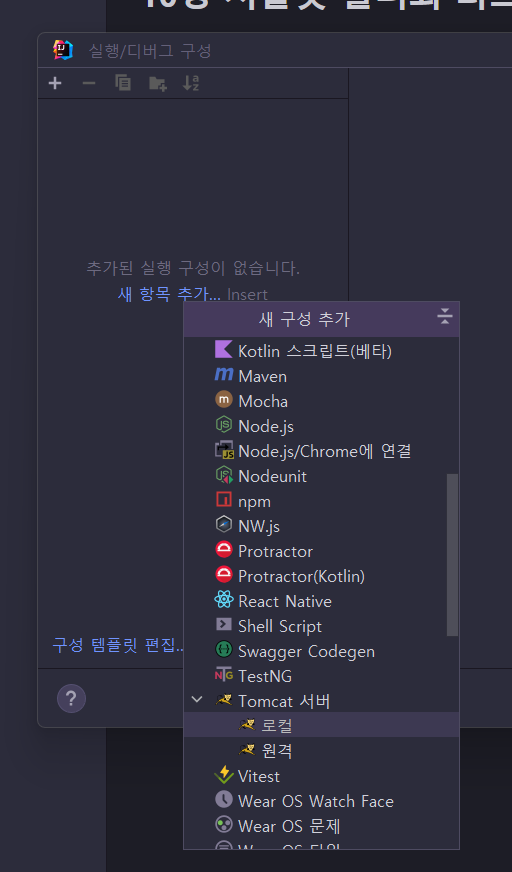
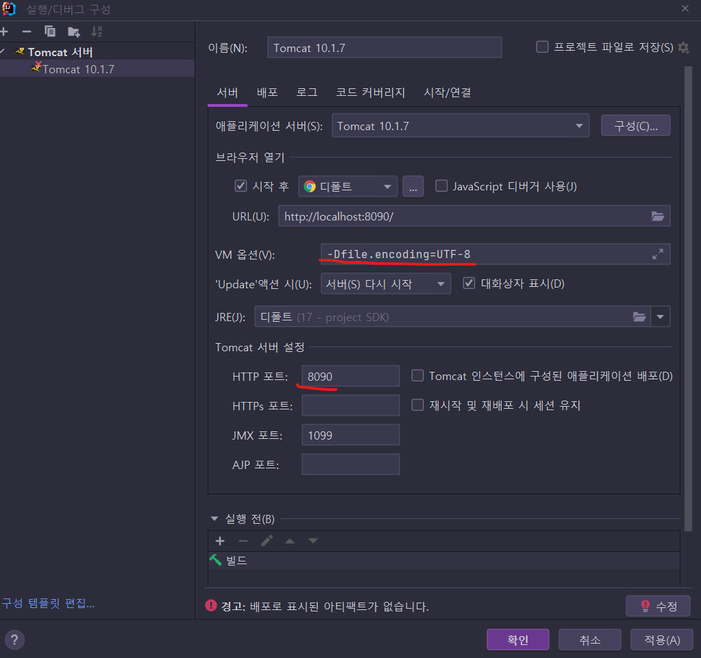
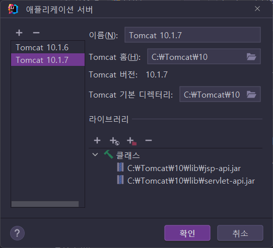
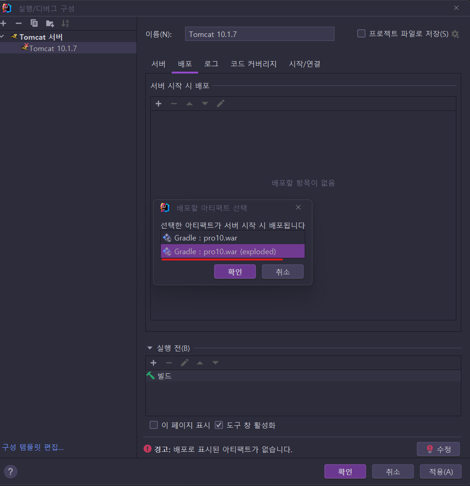
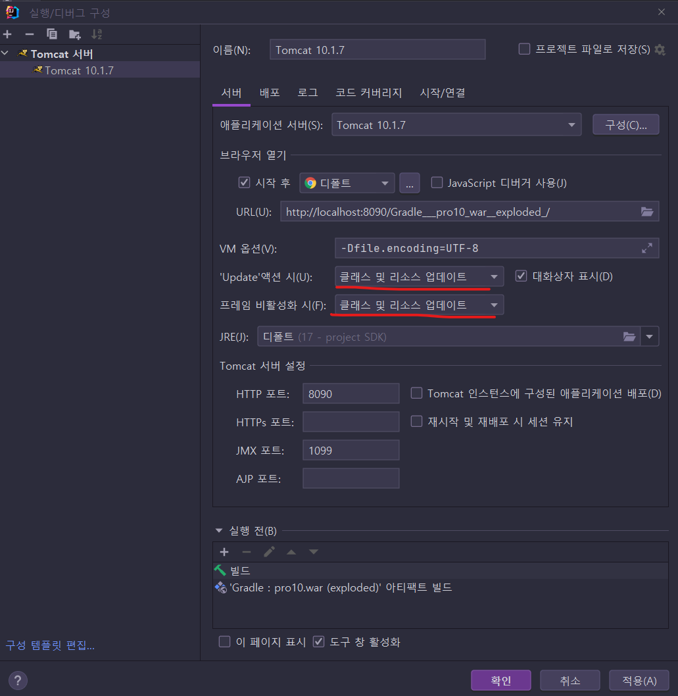
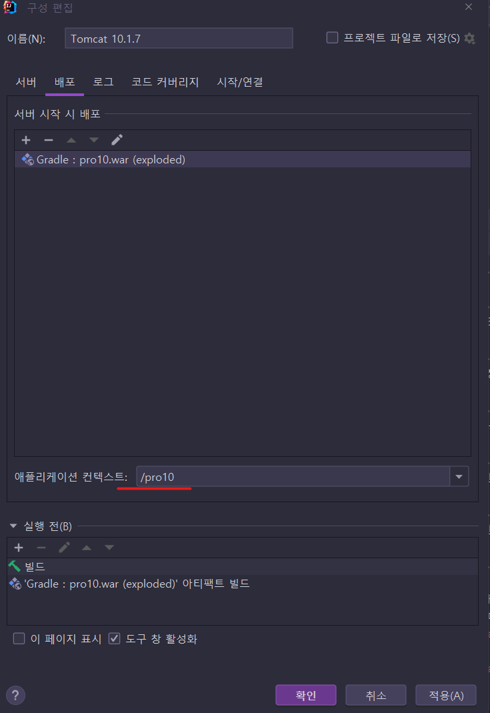
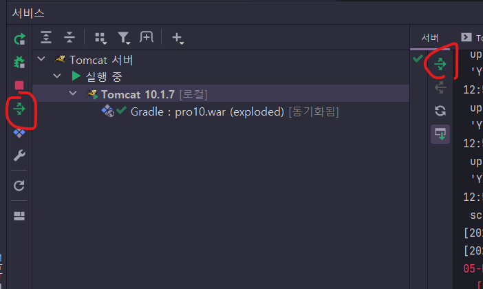

# IntelliJ에서 Tomcat 연동 설정 방법

> 설정방법이 그다지 복잡하진 않았지만, 문서로 추가해두자! 😄


## 설정 과정

### 1. Tomcat 준비

#### 1. 1. Tomcat 바이너리 압축파일을 다운로드 받아 적당한 곳에 푼다.

* https://tomcat.apache.org/download-10.cgi
* 나는 Tomcat 10.1.x 를 받음

#### 1.2. 데이터 소스 설정

* `{톰켓 설치경로}/conf/context.xml` 에 데이터 소스 설정을 추가한다.

  ```xml
      <Resource
        name="jdbc/oracle"
        auth="Container"
        type="javax.sql.DataSource"
        driverClassName="oracle.jdbc.OracleDriver"
        url="jdbc:oracle:thin:@localvmdb.oracle_xe_18c:1521:XE"
        username="scott"
        password="tiger"
        maxTotal="50"
        maxWaitMillis="-1"
      />
  ```

  - [x] `{톰켓 설치경로}/lib`에 ojdbc 라이브러리를 미리 넣어둬야할지? 확인필요.
    * Gradle의 Dependency 경로에 ojdbc 드라이버가 포함되어있으면 문제없이 잘 연결한다.


### 2. IntelliJ에서 프로젝트 열어서 설정

* 웹 프로젝트 구조로 이미 준비가 다 되었다고 가정.

1. 실행 `-> ` `구성 편집` -> `새 항목 추가` 에서 `Tomcat 서버 - 로컬` 선택
   

2. VM 옵션 추가 : `-Dfile.encoding=UTF-8` 및 포트 변경: `8090`

   

   * 구성에서 Tomcat 설치경로도 처음에 압축 풀은 경로로 정확하게 맞춰줌.

     

3. 배포 항목에서 `+` 버튼 눌러서 `아티팩트` 선택후 `exploded`항목으로 선택

   

4. 다시 서버 탭으로 돌아가서... 아래 두 항목을 `클래스 및 리소스 업데이트`로 바꿔줌.

   

5. 컨텍스트 루트의 경우는 `배포` 탭의 아래쪽 부분에 있음 (exploded 설정후 메뉴가 추가되고, 스크롤로 내리지 않으면 잘 안보임 😓)

   

   원하는 컨텍스트 경로를 정해줌.


## 기타

* 당연한 이야기지만 Tomcat 실행전에 DB(`Oracle`)가 사용가능한 상태여야한다.

* 이렇게 연동 했기 때문에, 디버깅이 아주 편해질 것 같다. 👍

  * Gretty로 하면 좀 원격 디버깅 연결해야하고 복잡해져서.. 😓

* JSP나 정적리소스 변경은 바로 반영되는데, 클래스 변경시는 아래 버튼(둘 중 아무거나)을 눌러주도록 하자, 그럼 Tomcat 재시작 없이 배포만함.

  

  