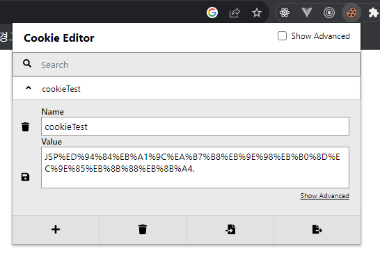
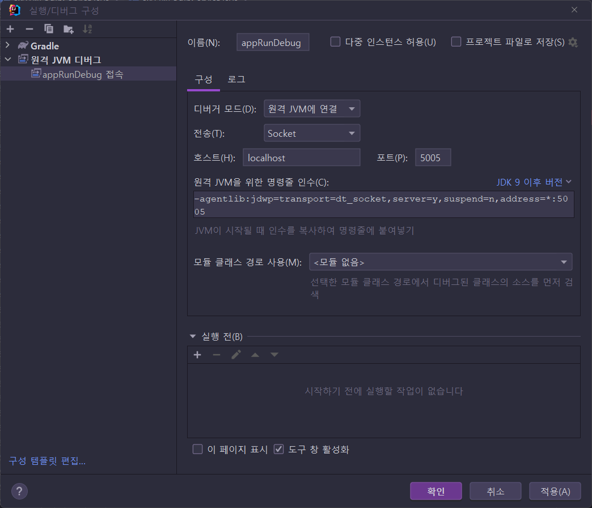

# 9장 쿠키와 세션 알아보기

> * 쿠키와 세션 .. 이번장도 중요한 내용이다. ✨
> * 예제 프로젝트: [pro09](pro09)


## 목차

### 9.1 웹페이지 연결 기능 

* ...

#### 

#### 9.1.1 세션 트래킹

* ...
* HTTP 프로토콜은 서버-클라이언트 통신시 Stateless 방식으로 통신함
* 세션 트래킹 (Session Tracking)
  * 사용자 입장에서 웹 페이지 사이의 상태나 정보를 공유하기 위해 프로그래머가 구현해야함
* 웹페이지 연동 방법
  * `<hidden> 태크`
  * URL Rewriting
  * 쿠키
  * 세션


### 9.2 `<hidden>` 태그와 URL Rewriting 이용해 웹페이지 연동하기

* ...

#### 9.2.1 `<hidden>`태그를 이용한 세션 트래킹 실습

* ...

#### 9.2.2 URL Rewriting을 이용한 세션 트래킹 실습

* ...


### 9.3 쿠키를 이용한 웹 페이지 연동 기능

* ...
  * Persistence 쿠키
    * 파일로 생성
  * Session 쿠키
    * 브라우저 메모리에 생성
* ✨ 이제 IE 관련해서는 내용이 빠져도 될 것 같다.. 현시점*(2023년 3월) Win10에서 IE를 일부러 켜도 Edge로 전환됨


#### 9.3.1 쿠키 기능 실행 과정

* ...
* 최초 접속시 서버에서 생성한 쿠키를 브라우저에서 파일로 저장
* 재접속시 서버가 브라우저에 쿠키 전송을 요청하면 브라우저는 쿠키 정보를 서버에 넘김
  * 서버는 넘겨받은 쿠키 정보로 작업처리


#### 9.3.2 쿠키 API

* ...
* `jakarta.servlet.http.Cookie` 를 사용
* setMaxAge() 인자 값으로 Persistence 쿠키 또는 Session 쿠키를 만들 수 있음.
  * 음수나 기본은 Session 쿠키 생성
  * 양수는 Persistence 쿠키 생성


#### 9.3.3 서블릿에서 쿠키 사용하기

* ...

* 크롬 [Cookie-Editor](https://chrome.google.com/webstore/detail/cookie-editor/hlkenndednhfkekhgcdicdfddnkalmdm) 플러그인으로도 잘 볼 수 있다. 

  


## 의견

* ...

  

## 정오표

* ...


## 기타

#### Gretty 로 실행시 jakarta.servlet-api 5.0.0 버전이 클래스 패스에 포함되는 문제

* Gretty 기본이 5.0.0으로 되어있어서 중복으로 나타난 듯 하다.

  * 이런 상태라서 디버깅 할 때, 둘 다 참조하는 식으로 되서  이상하게 됨.

* gradle.properties에 다음과 같이 설정을 추가해주면 된다.

  ```properties
  tomcat10ServletApiVersion=6.0.0
  ```

  * 원본 설정 참조
    * https://github.com/gretty-gradle-plugin/gretty/blob/master/gradle.properties


### 디버깅 진행 중 jakarta.servlet-api 의 소스로 포인터가 넘어갈 떄... 소스코드 불일치 문제..

 실제 런타임 환경 실행시는 `jakarta.servlet-api` 를 사용하지 않고 톰캣의 `tomcat-servlet-api`을 사용해서 그런 것 같다.

```groovy
compileOnly "org.apache.tomcat:tomcat-servlet-api:${tomcat10Version}"
```

그런데 이걸로 대체하더라도 별 의미는 없음. 😓 별로 신경쓰지 않아도 되는 문제 같다.


### Gretty로 실행한 웹애플리케이션의 디버깅

> Maven + Jetty 플러그인 사용할 때는 메뉴에서 디버깅 모드로 실행하면 그냥 잘 되었던 것 같은데..
>
> 좀 복잡하긴하다..😓

아래 명령을 실행하면 웹 애플리케이션이 디버깅 모드로 실행되고, 디버깅 TCP 5005에서  수신을 기다림

```bash
gradle clean appRunDebug
```

이후 IntelliJ에서 원격 JVM 디버그에 작업을 하나 추가해서 그것을 실행하면 작업을 추가할 수 있음.



위 작업을 실행 중인 상태에서 중단점을 설정하고 웹 요청을 하면 중단점이 동작하는 것이 보임.

* 그런데... 중단점 한번 지나고 요청이 끝나면 작업이 끝나는 것 같음.. 그때는 아래 버튼 눌러주면 되었음.

  
