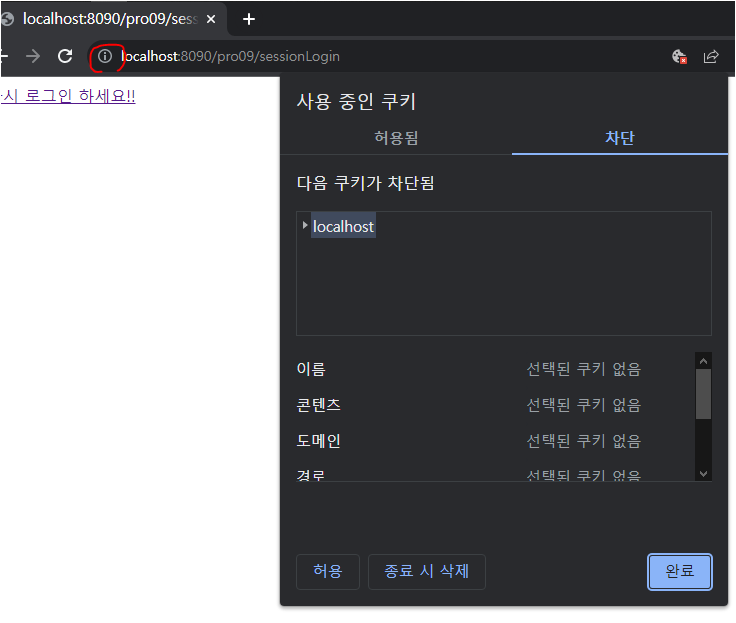
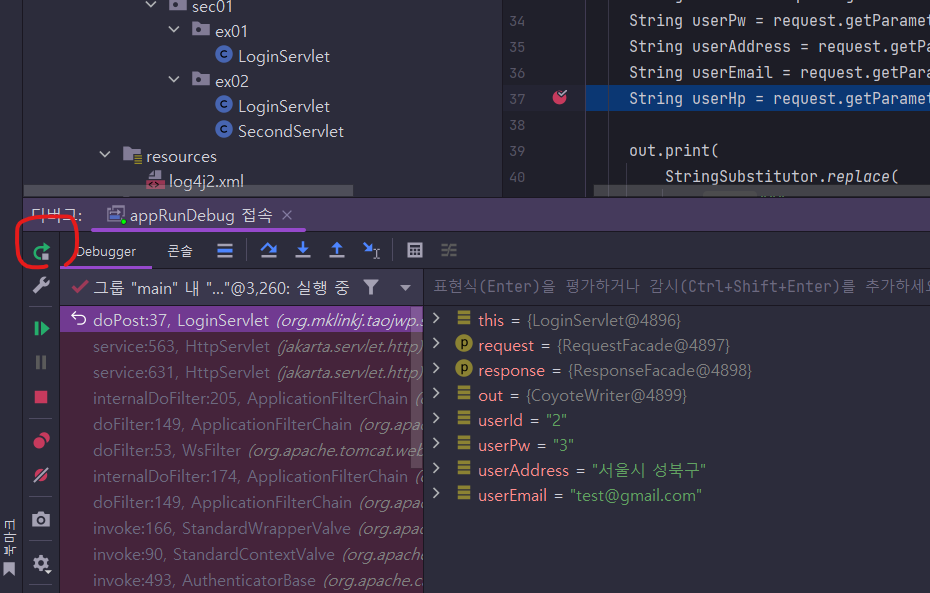

# 9장 쿠키와 세션 알아보기

> * 쿠키와 세션 .. 이번장도 중요한 내용이다. ✨
> * 예제 프로젝트: [pro09](pro09)


## 목차

### 9.1 웹페이지 연결 기능 

* ...
  

#### 9.1.1 세션 트래킹

* ...
* HTTP 프로토콜은 서버-클라이언트 통신시 Stateless 방식으로 통신함
* 세션 트래킹 (Session Tracking)
  * 사용자 입장에서 웹 페이지 사이의 상태나 정보를 공유하기 위해 프로그래머가 구현해야함
* 웹페이지 연동 방법
  * `<hidden> 태크`
  * URL Rewriting
  * 쿠키
  * 세션


### 9.2 `<hidden>` 태그와 URL Rewriting 이용해 웹페이지 연동하기

* ...

#### 9.2.1 `<hidden>`태그를 이용한 세션 트래킹 실습

* ...

#### 9.2.2 URL Rewriting을 이용한 세션 트래킹 실습

* ...


### 9.3 쿠키를 이용한 웹 페이지 연동 기능

* ...
  * Persistence 쿠키
    * 파일로 생성
  * Session 쿠키
    * 브라우저 메모리에 생성
* ✨ 이제 IE 관련해서는 내용이 빠져도 될 것 같다.. 현시점*(2023년 3월) Win10에서 IE를 일부러 켜도 Edge로 전환됨


#### 9.3.1 쿠키 기능 실행 과정

* ...
* 최초 접속시 서버에서 생성한 쿠키를 브라우저에서 파일로 저장
* 재접속시 서버가 브라우저에 쿠키 전송을 요청하면 브라우저는 쿠키 정보를 서버에 넘김
  * 서버는 넘겨받은 쿠키 정보로 작업처리


#### 9.3.2 쿠키 API

* ...
* `jakarta.servlet.http.Cookie` 를 사용
* setMaxAge() 인자 값으로 Persistence 쿠키 또는 Session 쿠키를 만들 수 있음.
  * 음수나 기본은 Session 쿠키 생성
  * 양수는 Persistence 쿠키 생성


#### 9.3.3 서블릿에서 쿠키 사용하기

* ...

* 크롬 [Cookie-Editor](https://chrome.google.com/webstore/detail/cookie-editor/hlkenndednhfkekhgcdicdfddnkalmdm) 플러그인으로도 잘 볼 수 있다. 

  

#### 9.3.4 세션 쿠키 사용하기

* ...

* 이전 예제에서 따로 분리하지 않아도 되겠다. 그냥 쿠키 수명만 -1로 바꿔주면 되어서...

  ```java
  // c.setMaxAge(24 * 60 * 60);
  c.setMaxAge(-1);
  ```

  

#### 9.4.5 쿠키를 이용해 팝업창 제한하기

* ...

* 팝업창 제어는 자바스크립트 상에서만 다룸.

* 여기서 책보고 따라 치다가 실수를 했는데...

  ```javascript
  cookieName = cookieName.replace(/^\s*/, ''); 
  ```

  공백제거를 다시 cookieName 으로 재할당을 하지 않아서 notShowPop의 값을 조회하려할 때 문제가 생긴점.

* 처음에는 부모 페이지와 팝업 페이지간 path 설정을 잘못해서 쿠키가 이중으로 생겼던 부분..😅
  * 역시 팜업이 추가되면 머리가 아픔...😅😅😅

#### 참고 주소

* https://ko.javascript.info/cookie
* https://developer.mozilla.org/en-US/docs/Web/JavaScript/Reference/Global_Objects/Date/toUTCString
  * toGMTString() 대신 toUTCString()으로 사용하라고 한다.
* https://developer.mozilla.org/en-US/docs/Web/HTTP/Headers/Set-Cookie/SameSite
  * 이건 Firefox에서 경고로 나오긴 하는데.. 나중에 알아보자..


### 9.4 세션을 이용한 웹 페이지 연동 기능

* ...
* 세션 특징
  * 정보가 서버의 메모리에 저장됨
  * 브라우저의 세션 연동은 세션 쿠키를 이용함.
  * 서버에 부하를 줄 수 있음
  * 브라우저당 한개의 세션 ID가 생성됨
  * ...

#### 9.4.1 세션 기능 실행 과정

* ...
* 서버로 부터 전송된 세션 ID의 쿠키 이름: `jsessionId`
  * 지금까지 예제에서 세션 기능을 쓰지 않아 생성되는 경우는 없었음.
  * 일단 서버에서 세션 객체를 생성해야 브라우저로 세션 ID를 쿠키로 설정


#### 9.4.2 세션 API의 특징과 기능

* ...
* `HttpServletRequest`의 `getSession()` 메서드를 호출해서 생성


#### 9.4.3 서블릿에서 세션 API 이용하기

* ...
* 테스트에서 MockHttpSession 의 nextId 필드가 static 인 덕분에 해깔려서 🎃 시간이 많이 걸림..😅


#### 9.4.4 다른 브라우저에서 새 세션 만들기

* ...
* `/sess2` : 세션 만료 타임아웃 5초 설정
* `/sess3` : 서블릿 메서드내에서 세션을 얻고 메서드 종료직전 바로 만료시킴
  * 이건 Mock환경에서 테스트가 힘들다.
  * https://github.com/akhikhl/gretty/tree/master/integrationTests 이 테스트 방법 나중에 참고해보자...


#### 9.4.5 세션을 이용한 로그인 정보 바인딩 실습

* ...

* Tomcat 10.1.6의 context.xml에서는 다음과 같이 되어있던데.. 

  ```xml
  <!-- Uncomment this to enable session persistence across Tomcat restarts -->
  <!--
    <Manager pathname="SESSIONS.ser" />
  -->
  ```

  저자님은 저 옵션에 빈값(`""`)을 넣어서 사용불가능하게 하는 것 같은데.. Tomcat 10.1.x에서는 저렇게 주석인 채로 두면 재시작하더라도 세션 보관이 안될 것 같다.
  
  * 주석된 채로 두었다.


### 9.5 encodeURL() 사용법

* ...
* jsessionId가 URL 창에 파라미터로 노출될때, 원인이 좀 해깔렸는데.. 이번에 좀 알 수 있을 것 같다.
* 쿠키를 사용할 수 없는 브라우저
  * 서버에서 URL Rewriting으로 JSESSIONID를 보내서 클라가 서버에 요청할 때. JSESSIONID를 파라미터에 담아 보내게끔 함.
  * 이 값이 나타날때가 브라우저에서 쿠키 사용이 안되어서 그랬나? 🎈


#### 9.5.1 브라우저 쿠키 사용 금지하기 

* localhost에 한해서만 쿠키 차단이 되어서 그렇게 해봄.

  

* 이렇게 했을 때, 서버측에 세션을 생성을 할 수는 있는데, 브라우저가 ID가 없어서 재접속시 서버측 세션을 사용할 수가 없음.

  * web.xml에 아래 내용을 추가해보면 코드 수정없이 그냥 URL 파라미터로 붙여주나 했는데.. 안됨

    ```xml
      <!-- https://tomcat.apache.org/tomcat-10.1-doc/servletapi/jakarta/servlet/SessionTrackingMode.html -->
      <session-config>
        <tracking-mode>URL</tracking-mode>
      </session-config>
    ```

  * 이게 그냥 되는건 아니고 `<c:url>` 같은 JSTL 태그로 주소를 만들때 붙여주는 것같다.

    * JSP 붙여서 확인해보니 진짜 잘 붙음.

      ```
      <c:url value=""/>출력값: http://localhost:8090/pro09/;jsessionid=8ADA87C4EF01407551C3724EF4E20DE6
      ```

      

      

  * 그런데 나는 정적으로 주소를 적어두어서. 안되는 듯...

* 프로젝트에 JSP, JSTL 라이브러리를 추가해고 최신 JSTL 3.0.1을 추가했는데.. IntelliJ에서 `jakarta.tags.core`에 대한 자동완성을 지원해주지 않는다. 

  ```jsp
  <%@ taglib prefix="c" uri="jakarta.tags.core" %>
  <%--<%@ taglib prefix="c" uri="http://java.sun.com/jsp/jstl/core" %>--%>
  
  <h4>&lt;c:url value=""/&gt;출력값: <c:url value=""/></h4>
  ```

  이렇게 하면 IDE 화면에서는 오류 밑줄이 그어지지만, 실행은 잘됨.

  * 최신 JSTL 라이브러리에 이전 1.2 버전 tld파일이 포함되어 있어서 이전 이름을 사용하더라도 동작은 함.

  몇몇 유저가 이슈를 JetBrains에 이슈를 올려놧는데.. 이번 년초내로 고쳐질 것 같다.

  * https://youtrack.jetbrains.com/issue/IDEA-308542/JSTL-Jakarta-Standard-Tag-Library-3.0.0-has-a-new-namespace-and-URI-for-TLD-files-IntelliJ-does-not-recognise-this


#### 9.5.2 encodeURL() 메서드를 이용한 세션 사용 실습

* HttpServletResponse의 encodeURL('주소') 를 수행하면 여기에 JSESSIONID를 파라미터로 붙혀줌.

  ```
  http://localhost:8090/pro09/blockCookieSessionLogin;jsessionid=372E086696C5A73AA53D76E558AF214E
  ```

* Mock테스트로는 재현이 힘들다.

  * MockHttpServletRequest의 encodeURL()은 입력받은 값 그대로 반환함.


### 9.6 세션을 이용한 로그인 예제

* ...

> 그런데...
>
> DB 데이터도 서버 시작할 때.. 테이블 DROP `>` 테이블 CREATE `>` 데이터 INSERT 되는식으로 프로젝트를 바꿔나와겠다. 😅 데이터를 미리 확인해야되서 귀찮음.
>
> sql 파일을 실행하는 코드는 `spring-jdbc` 에 포함된 `` 클래스를 사용하면 되는데... spring-jdbc를 메인 디펜던시로 걸어두긴하지만, SQL 스크립트 실행기능만 쓸것이라 별문제는 없을 것 같다.


## 의견

* 서블릿 테스트 코드를 모두 작성하면서 하다보니 시간은 엄청걸리는데...😅 그래도 느끼는 점이 있음👍

* 이번에 DB 초기화하는 기능 붙였는데... 진작에 붙일 것을 그랬다. 테스트하기가 더 편해짐.😎

  

## 정오표

* ...


## 기타

### MockHttpSession 테스트시... 주의점 (nextId 필드가 static 변수 임 😈)

```java
private static int nextId = 1;
```

이 필드가 static으로 되어있어서.. MockHttpSession 을 초기화하더라도 이전 id상태값을 참고하여 다시 증감시키게된다.

따로 외부에서 초기화 시켜주는 public 메서드가 없어서 해당 인스턴스를 새로 넣더라도 초기화가 되는 값이 아님.

(JVM 종료 하고 다시시작해야 확실히 초기화됨.)

SessionTestTest에서 testDoGetWithExistingSession()에는 명시적으로 id값을 0으로 주었고, 

testDoGetWithNewSession()는 서블릿에서 얻을 때, 자동으로 생성된 것 받아가게 설정했음.

> 이거 처음엔 메서드 테스트 메서드 시작할 때마다 new로 새로운 값을 넣는데.. 왜그러지? ㅠㅠ 혼란이 왔음.😂
>
> ✨ 결국엔 Session ID를 검증하는 테스트는 안하는게 낫겠다.  전체 테스트를 할 경우 또 예측하지 못할 번호가 나올 수 있음.
>
> 그래도 Assert J에서 패턴 매칭으로도 출력감을 검증할 수 있기 때문에, 숫자가 찍히는지 여부만 확인하면 되겠다.
>
> ```java
> assertThat(response.getContentAsString())
>               .containsPattern("세션 아이디: \\d+") 
>               .contains("세션 유효 시간: 3")
>               .contains("새 세션이 만들어졌습니다.");
> ```


#### Gretty 로 실행시 jakarta.servlet-api 5.0.0 버전이 클래스 패스에 포함되는 문제

* Gretty 기본이 5.0.0으로 되어있어서 중복으로 나타난 듯 하다.

  * 이런 상태라서 디버깅 할 때, 둘 다 참조하는 식으로 되서  이상하게 됨.

* gradle.properties에 다음과 같이 설정을 추가해주면 된다.

  ```properties
  tomcat10ServletApiVersion=6.0.0
  ```

  * 원본 설정 참조
    * https://github.com/gretty-gradle-plugin/gretty/blob/master/gradle.properties


### 디버깅 진행 중 jakarta.servlet-api 의 소스로 포인터가 넘어갈 떄... 소스코드 불일치 문제..

 실제 런타임 환경 실행시는 `jakarta.servlet-api` 를 사용하지 않고 톰캣의 `tomcat-servlet-api`을 사용해서 그런 것 같다.

```groovy
compileOnly "org.apache.tomcat:tomcat-servlet-api:${tomcat10Version}"
```

그런데 이걸로 대체하더라도 별 의미는 없음. 😓 별로 신경쓰지 않아도 되는 문제 같다.


### Gretty로 실행한 웹애플리케이션의 디버깅

> Maven + Jetty 플러그인 사용할 때는 메뉴에서 디버깅 모드로 실행하면 그냥 잘 되었던 것 같은데..
>
> 좀 복잡하긴하다..😓

아래 명령을 실행하면 웹 애플리케이션이 디버깅 모드로 실행되고, 디버깅 TCP 5005에서  수신을 기다림

```bash
gradle clean appRunDebug
```

이후 IntelliJ에서 원격 JVM 디버그에 작업을 하나 추가해서 그것을 실행하면 작업을 추가할 수 있음.


위 작업을 실행 중인 상태에서 중단점을 설정하고 웹 요청을 하면 중단점이 동작하는 것이 보임.

* 그런데... 중단점 한번 지나고 요청이 끝나면 작업이 끝나는 것 같음.. 그때는 아래 버튼 눌러주면 되었음.

  
