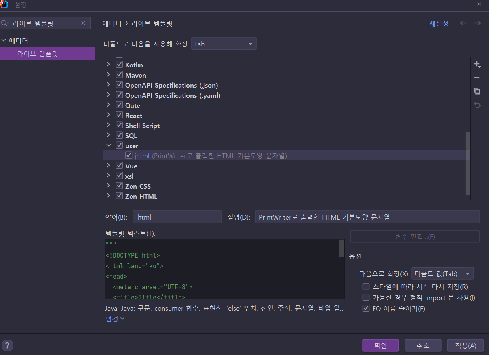

# 10장 서블릿 필터와 리스너 기능

> * 기초는 중요하지 않은 부분이 없음... ✨
> * 이번엔 IntelliJ에서 Tomcat 10.1.x를 연동해서 사용하자! 다른 스터디에서 설정했을 때 엄청 편했음.👍
> * 예제 프로젝트: [pro10](pro10)


## 목차

### 10.1 서블릿 속성과 스코프

* 서블릿 속성: 다음 3가지 서블릿 API클레스에 저장되는 객체

  1. ServletContext
  2. HttpSession
  3. HttpServletRequest

  

* 서블릿 스코프
  * 서블릿 API에 바인딩된 속성에 대한 접근 범위

* 스코프 종류
  | 스코프 종류         | 해당 서블릿 API    | 속성의 스코프     |
  | ------------------- | ------------------ | ----------------- |
  | 애플리캐이션 스코프 | ServletContext     | 애플리케이션 전체 |
  | 세션 스코프         | HttpSerssion       | 브라우저          |
  | 리퀘스트 스코프     | HttpServletRequest | 해당 요청         |

* ...


### 10.2 서블릿의 여러가지 URL 패턴

* ...
* URL 패턴: 반드시 /로 시작해야함.


#### 10.2.1 서블릿에 여러가지 URL 패턴 적용 실습

* ...
  * 완전일치가 최우선
  * 그 다음 경로
  * 그 다음 와일드 카드 확장자 매핑


### 10.3 Filter API

* ...
* 서블릿에서 반복적으로 처리해야하는 작업을 필터 클래스로 설정해두면 좋음 👍


#### 10.3.1 사용자 정의 Filter 만들기

* ...


#### 10.3.2 Filter를 이용한 한글 인코딩 실습

* ...

* Tomcat 10.1.7의 경우 request, response 인코딩에 대해 기본으로 UTF-8 설정이 들어가 있다..

  * tomcat conf의 web.xml

    ```xml
      <!-- Set the default request and response character encodings to UTF-8.   -->
      <request-character-encoding>UTF-8</request-character-encoding>
      <response-character-encoding>UTF-8</response-character-encoding>
    ```

    한글이 깨지는 것을 확인하려면 저 내용을 주석 처리해야함.

    * 책의 환경과 맞춰야하니 주석으로 바꿔두었다.


## 의견

* 

  


## 정오표

* p372: 코드 10-8
  * request.getRealPath(pathinfo) `->` this.context.getRealPath(pathinfo)
  * getRealPath()메서드가 ServletContext에 있다.
    * https://jakarta.ee/specifications/platform/9/apidocs/jakarta/servlet/servletcontext#getRealPath-java.lang.String-


## 기타

* p360~361 예제 보니 request로 부터 얻은 PrintWriter를 close하는 코드가 들어가던데.. 이걸 닫는 건 컨테이너의 책임이라고 생각해서.. 나는 닫지 말자..

* String으로 HTML을 치는 일이 많은데 기본 형태를 IntellJ의 Live Template로 지정해두자

  ```java
  """
  <!DOCTYPE html>
  <html lang="ko">
  <head>
    <meta charset="UTF-8">
    <title></title>
    <style>   
    </style>
  </head>
  <body>
    
  </body>
  </html>
  """
  ```

  

  * jhtml 치면 바로 템플릿 문자열 추가됨, 변수화 시키는 부분도 있는 것 같은데.. 그부분은 나중에..😄

