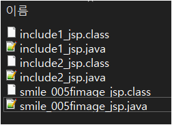
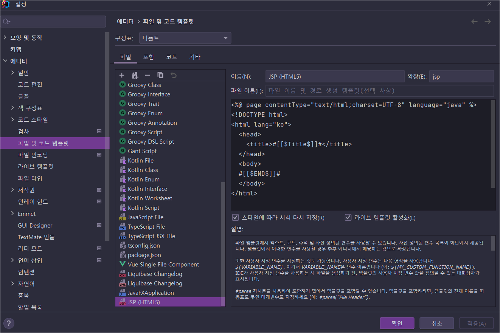
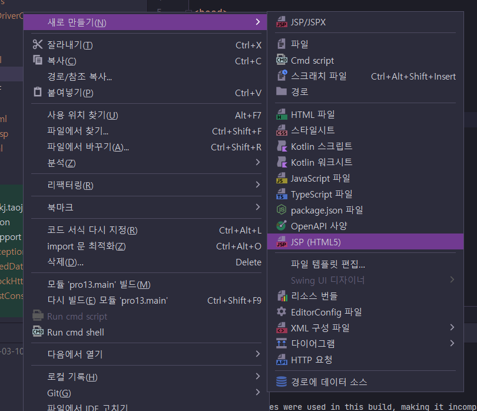

# 13장 자바 코드를 없애는 액션 태그


> * 액션 태그에서 인클루드 액션 태그는 업무에서도 썼던 것 같기도 하고 기억이.....😅
> * 예제 프로젝트: [pro13](pro13)

* 디자에너 입장에서 더 쉽고 편리하게 작업할 수 있는 태그 형태로 기능제공


### 13.1 인클루드 액션 태그 사용하기

* ...

* 인클루드 액션 태그와 인클루드 디렉티브 태그의 중요 차이

  * 인클루드 액션 태크는 포함되는 JSP가 각각 자바 파일로 생성

    ```
    ```

  * 인클루드 디렉티브 태크는 합쳐져서 하나의 자바 파일로 생성

    ```jsp
    <% include file="duke_image.jsp" %>
    ```

  * 정말 하나의 파일로 생성되는지? 별도 클래스로 분리되어있음.

    

    

  * 부모 페이지에서 자식으로 파라미터 전달하는 부분

    ```java
    org.apache.jasper.runtime.JspRuntimeLibrary.include(request, response, "smile_image.jsp" + "?" + org.apache.jasper.runtime.JspRuntimeLibrary.URLEncode("name", request.getCharacterEncoding())+ "=" + org.apache.jasper.runtime.JspRuntimeLibrary.URLEncode("스마일", request.getCharacterEncoding()) + "&" + org.apache.jasper.runtime.JspRuntimeLibrary.URLEncode("imgName", request.getCharacterEncoding())+ "=" + org.apache.jasper.runtime.JspRuntimeLibrary.URLEncode("smile.png", request.getCharacterEncoding()), out, true);
    ```

    


---

## 의견

* ...

  

## 정오표

* ...
  


## 기타

* IntelliJ에서 JSP 파일 만들때... 기본 템플릿이 쓸때없이 OS 유저명이나 호스트명 포함된 주석이 포함되고 HTML5 관련 내용도 포함이 안되어서 템플릿 추가했다.

  

  ```jsp
  <%@ page contentType="text/html;charset=UTF-8" language="java" %>
  <!DOCTYPE html>
  <html lang="ko">
    <head>
      <meta charset="UTF-8">
      <title>#[[$Title$]]#</title>
    </head>
    <body>
    #[[$END$]]#
    </body>
  </html>
  
  ```

  이렇게 설정해두면...  새로만들기 할 때... 나타남..

  
