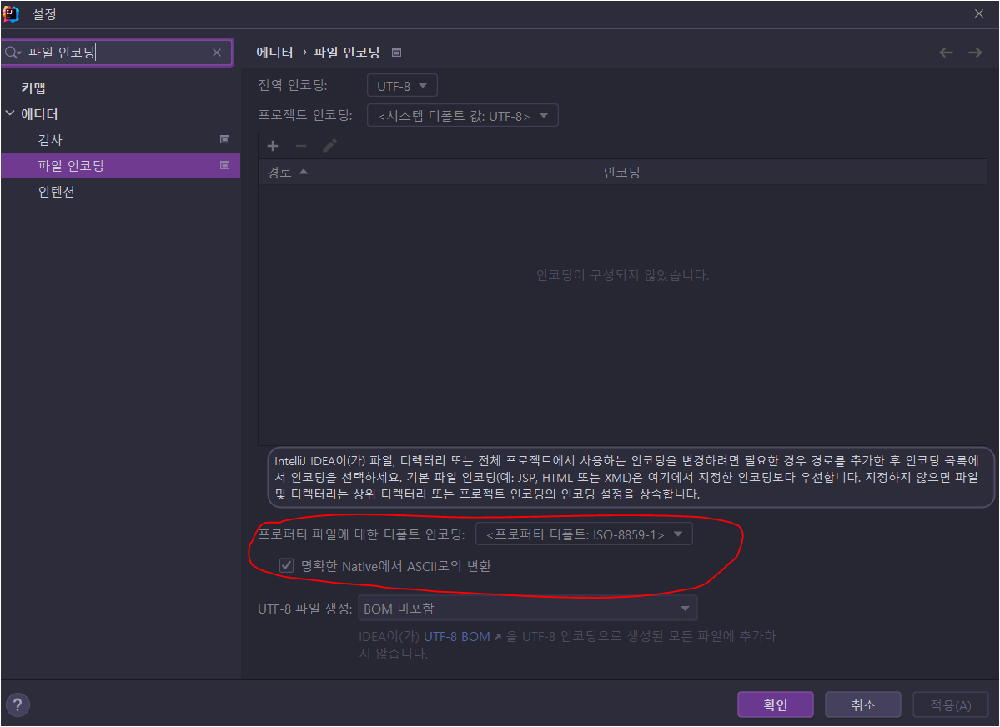
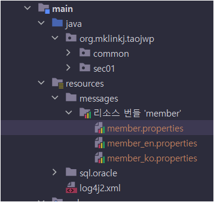

# 14장 표현 언어와 JSTL


> * ...
> * 예제 프로젝트: [pro14](pro14)


### 14.1 표현 언아란?

* ...

* 기존 표현식 보다 편리하게 값을 출력

  * 기존 표현식 `<%=id %>` ==> `${id}`

  * page 디렉티브 태그 속성인 `isELIgnored`를 `false`로 설정해야함. (`false`가 기본값)

    * IntelliJ의 JSP Directives 2_1.xsd에서는 isELIgnored의 기본 값이 true로 되어있다.

    * JSP 2.1에서는 아마도 이 설정이 false였나봄.. 그런데 지금 사용환경이 JSP 3.1이다.

      ```
      \${100}: ${100 + 10} 
      위의 수식이 isELIgnored가 true이면 
      \${100}: ${100 + 10} 와 같이 그대로 출력
      
      false이면
      ${100}: 110 로 출력된다.
      ```

    * 현재 환경에서는 딱히 명시하지 않아도 되니 해당 속성설정을 빼두자.

      

      


#### 14.1.1 표현 언어에서 사용되는 자료형과 연산자

* ...

  

#### 14.1.2 JSP에서 표현 언어 사용 실습

* ...


## 14.2 표현 언어 내장 객체(내장 변수)

* ...

### 14.2.1 표현 언어에서 제공하는 내장 객체의 종류와 기능

* ...

### 14.2.2 param 내장 객체 사용 실습

* ...

### 14.2.3 requestScope 사용 실습

* ...

### 14.2.4 pageContext 객체 사용 실습

* ...

### 14.2.5 빈 사용 실습

* ...

### 14.2.6 Collection 객체 사용 실습

* ...

### 14.2.7 HashMap 사용 실습

* ...

### 14.2.8 has-a 관계 빈 사용 실습

* ...


## 14.3 표현 언어로 바인딩 속성 출력하기

* ...

### 14.3.1 내장 객체 속성 값 출력 실습

* ...

### 14.3.2 스코프 우선순위

* ...

* #### page > request > session > application


## 14.4 커스텀 태그

* JSTL (JSP Standard Tag Library) 와 개발자가 만든 커스텀 태그


## 14.5 JSP 표준 태그 라이브러리 (JSTL)

* ...

* JSTL 1.2 구현을 받을 수 있긴한데... 

  * https://tomcat.apache.org/download-taglibs.cgi

* 최신 Jakarta Standard Tag Library 3.0 이 구현된 라이브러리를 포함시켜놨다.

  * https://jakarta.ee/specifications/tags/

  ```groovy
  implementation "jakarta.servlet.jsp.jstl:jakarta.servlet.jsp.jstl-api:${jakartaServletJspJstlApiVersion}"
  implementation "org.glassfish.web:jakarta.servlet.jsp.jstl:${jakartaServletJspJstlVersion}"
  ```

  * 최신 구현이라도 1.2 구현도 그대로 사용할 수 있었다. (1.2버전 tld파일도 포함되어있음.)
  * Impl(`glassfish 구현체`)과 Spec(`api`) 은 대응되는 것을 넣은 것 같고, EL과 Compat는 지금 시점에 따로 안넣어줘도 되는 것 같다.


## 14.6 Core 태그 라이브러리 사용하기

* ...

### 14.6.1 `<c:set>` 태그를 이용한 실습

* ...

### 14.6.2 `<c:remove>` 태그를 이용한 실습

* ...

### 14.6.3 `<c:if>` 태그를 이용한 실습

* ...

### 14.6.4 `<c:choose>` 태그를 이용한 실습

* ...

### 14.6.5 `<c:forEach>` 태그를 이용한 실습

* ...

### 14.6.6 `<c:url>` 태그를 이용한 실습

* ...

### 14.6.7 `<c:redirect>` 태그를 이용한 실습

* ...

### 14.6.8 `<c:out>` 태그를 이용한 실습

* ...
* 그냥 EL로 출력하면 이스케이프가 안됨 `<c:cout>` 으로 출력하면서  `escapeXml="true"` 이면 `<`, `>` 등이 이스케이프됨. 그런데 true가 기본값이다.


## 14.7 Core 태그 라이브러리 실습 예제

* ...

### 14.7.1 로그인 예제

* ...

### 14.7.2 학점 변환기 예제

* ...

### 14.7.3 구구단 출력 예제

* ...

### 14.7.4 이미지 출력 예제

* ...


## 14.8 다국어 태그 라이브러리 사용하기

* ...


## 14.9 한글을 아스키 코드로 변환하기

* 한글을 유니코드의 코드값으로 저장하는 것 같은데...

* Eclipse가 아니니 Properties Editor는 따로 설치할 수 없고, IntelliJ에서 확인해보자!!

* IntelliJ에서는 이미 해당 기능이 포함되어있다.

  * ~~중요한 건... 프로퍼티 파일을  ISO 8859-1 인코딩으로 저장해야함.~~ UTF-8로 저장해도 잘 됨.
  
  * ~~관련 프로퍼티를 읽는 Java의 클래스가 프러퍼티 파일의 인코딩이 ISO-8859-1일 것으로 간주하고 한글 같은 것은 유니코드 값으로 읽어들임.~~
  
    * UTF-8로 먼저 읽고 실패시 ISO-8859-1로 읽음
    
    
    
  
* 내 환경의 경우는 그냥 `src/main/resouces`에 `messages` 폴더 하나 만들고 거기에 메시지 프로퍼티 파일을 모아둠.

  

* JSP에서는 아래와 같이 사용함.

  ```jsp
  <fmt:setLocale value="en_US" />
  <%--<fmt:setLocale value="ko_KR" />--%>
  <h1>
    회원정보<br><br>
    <fmt:bundle basename="messages.member" prefix="mem." >
      이름:<fmt:message key="name" /><br>
      주소:<fmt:message key="address" /><br>
      직업:<fmt:message key="job" />
    </fmt:bundle>
  </h1>
  ```

* UTF-8 인코딩으로 한글 그대로 저장해도 잘 되어서 나중에는 UTF-8로 바꾸고 `명확한 Native에서 ASCII로 변환` 체크도 해제함.


## 14.10 포매팅 태그 라이브러리 사용하기

* ...


---

## 의견

* ...

  

## 정오표

* 575쪽
  * 안쪽 `<c:choose>`의 A학점 조건에서 100점도 포함되도록 `=`를 추가해야함


## 기타

* 현시점에는 `isELIgnored="false"`가 기본값이기 때문에 따로 명시하지 않아도 되긴하지만.. 이번 장에서만 그냥 써주자..😅

