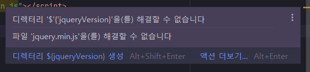

# 16장 HTML5와 제이쿼리


> * jQuery 사용 예제는 최신 ES6이상 자바스크립트 코드를 사용하자.
> * JSON 라이브러리는 [`json-simple`](https://mvnrepository.com/artifact/com.googlecode.json-simple/json-simple) 대신, 현시점에 보편적인 [`jackson-databind`](https://mvnrepository.com/artifact/com.fasterxml.jackson.core/jackson-databind) 를 사용하도록 하자.
> * 예제 프로젝트: [pro16](pro16)


## 16.1 HTML5 주요 개념

* ...
  

## 16.2 HTML5 시맨틱 웹을 위한 구성 요소

* ...

### 16.2.1 HTML5에 추가된 웹 페이지 구조 관련 태그

* ...

### 16.2.2 HTML5 웹 페이지 구조 관련 태그 사용

* ...


## 16.3 제이쿼리 주요 개념

* ...

* webjars로 한번 써볼까해서 넣어봤는데...

  * https://www.webjars.org/documentation#servlet3

  * 

  * 지금 서블릿 3.0이상이기 때문에 특별히 추가할 것은..

    ```groovy
    implementation 'org.webjars:jquery:3.6.3'
    ```

    위의 내용만 추가하고 사용처에서는 단지... 아래 내용만 추가해주면 되는 것 같다.

    ```html
    <script src="webjars/jquery/3.6.3/jquery.min.js"></script>
    ```

    버전을 빼는 방법을 해보려했는데.. 잘안된다... locator를 추가해도 잘 안되는 듯..😓
    
    * Gradle Build 스크립트에서 버전부분을 치환해주는 방법으로 해결했다. 😄
    
      * https://github.com/mklinkj/the-art-of-java-web-programming-study/issues/7
    
    * 그런데... 약간의 이슈가... IDE에디터에서 편집을 할 때..
    
      ```html
      <script src="/webjars/jquery/${jqueryVersion}/jquery.min.js"></script>
      ```
    
      위와 같이 처리되어 있는 부분에 대해서 
    
      
    
      위처럼 경고가 나타나긴 하는데, 에러로 간주하진 않고 실제 코드를 입력하면서 참조할 때.. 선언선택으로 실제 경로를 선택해서 구현을 볼 수 있음. 
  
  

## 16.4 제이쿼리의 여러가지 기능

* ...

### 16.4.1 제이쿼리 선택자 사용 실습

* ...


## 16.5 제이쿼리 Ajax 기능

* ...

### 16.5.1 제이쿼리 Ajax 사용법

* ...

### 16.5.2 제이쿼리 Ajax 사용하기

* ...

### 16.5.3 XML 데이터 연동하기

* ...

### 16.5.4 ID 중복 여부 확인하기

> MyBatis에서는 이미 잘 알고 있으니, 책에 JDBC 코드 사용 부분 MyBatis로 전환하자. 
>
> 책의 코드는 한번 내용만 보고, MyBatis나 Hibernate로 바꿔서 적용하는게 지루하지 않겠다. 👍

* MyBatis를 잘 추가하였다.. Spring이 다 알아서 해주는 환경에서만 쓰다보니... 잘몰랐던 점이 있는데...

  * MyBatis의 openSession()으로 얻을 때.. 아무 인자 없이 사용하면 autoCommit이 false이다.

  * 테스트 할 때.. autoCommit을 false로 설정한다는 로그가 보여서 뭔가?했음...

    ```
    00:55:57.332 [Test worker] DEBUG org.apache.ibatis.transaction.jdbc.JdbcTransaction - Opening JDBC Connection
    00:55:57.363 [Test worker] DEBUG org.apache.ibatis.transaction.jdbc.JdbcTransaction - Setting autocommit to false on JDBC Connection [oracle.jdbc.driver.T4CConnection@3a5c2626]
    ...
    ```

    

## 16.6 제이쿼리에서 JSON 사용하기

> 저자님은 json-simple 이라는 라이브러리 사용하셨는데, 나는 현시점으로 보편적인 jackson-databind를 사용하자.

* ...

### 16.6.1 JSON의 자료형 사용 실습

* ...


---

## 의견

* ...

  


## 정오표

* ...
  
  

## 기타

* ...
