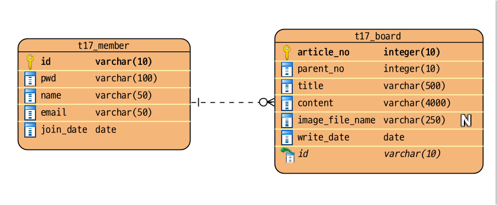
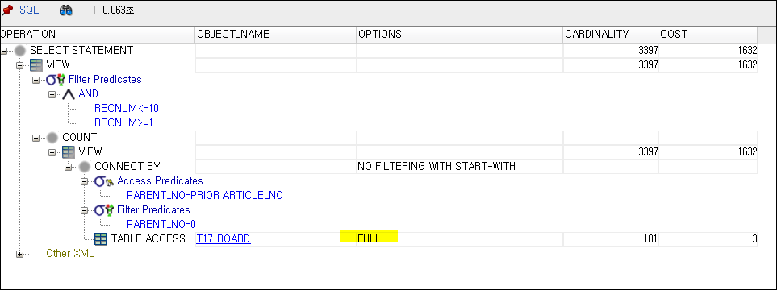
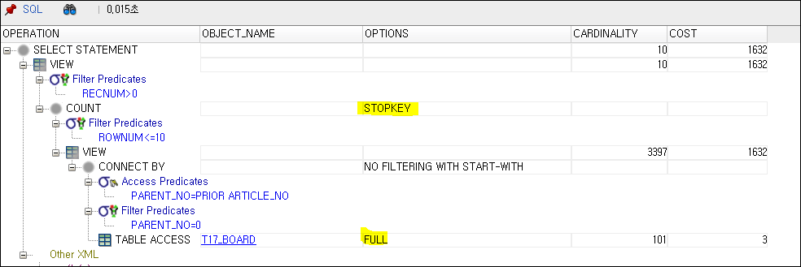
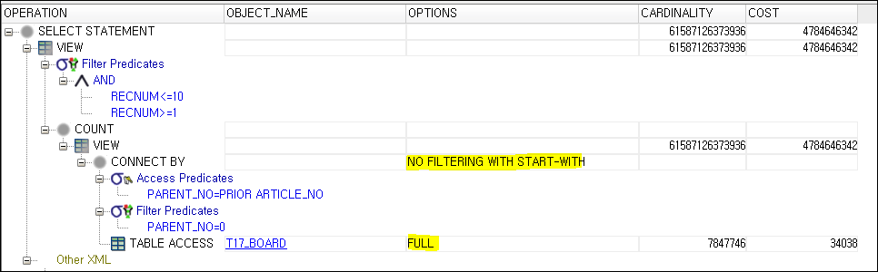
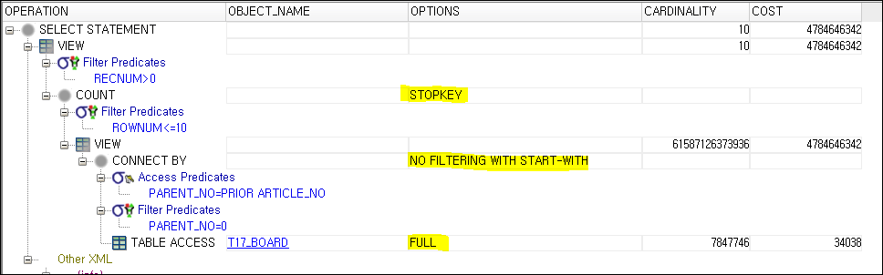
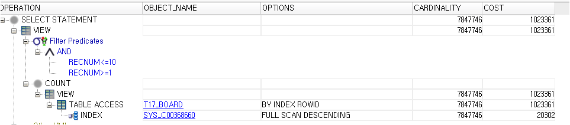
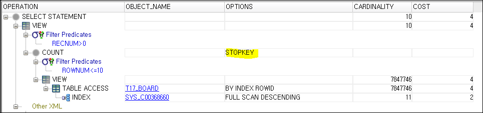

# 17장 모델2 방식으로 효율적으로 개발하기


> * 답글 구현에 저자님께서 진행하신 Oracle 계층형 쿼리로도 해보고,  MySQL 또는 HSQLDB에서도 진행을 별도해보자..
>   * Oracle 계층형 쿼리를 이해를 하는 것이 좋을 것 같은데...
>   * DB 쿼리로 가능하면 DB쿼리로 사용하는 것이 낫겠다. 내가 좀 왠만한 건 Java 단의 프로그래밍 처리가 무조건 낫다는 약간의 고정관념이 있긴한데... 생각을 유연하게 할 필요가 있음.
>   * 매퍼 인터페이스 위에 어노테이션 붙여서 쿼리적던 것을 매퍼 XML을 사용하도록 설정을 바꿨다.
>     * 나중에 동적 쿼리사용할 때는 Mapper XML 사용하는 것이 훨씬 나음.
> * 예제 프로젝트: [pro17](pro17)


## 17.1 웹 애플리케이션 모델

* ...

### 17.1.1 모델 1 방식

* ...

### 17.2.2 모델 2 방식


## 17.2 MVC 디자인 패턴

* ...

### 17.2.1 MVC 구성 요소와 기능

* ...


## 17.3 MVC를 이용한 회원 관리

* ...

### 17.3.1 회원 정보 조회 구현

* ...

* 부트 스트랩을 적용했는데, 생산성이 좋아지고 있다.
  * https://getbootstrap.com/docs/5.2/getting-started/introduction/
  * 빙 챗봇에 물어가면서 하니까 효율이 아주 좋음 👍, 질문의 이해를 아주 잘함 😄


### 17.3.2 회원 정보 추가 기능 구현

* ...
* 통합해서 사용할까 했는데.. 저자님 하시는대로 본리는 하는데, MemberController만 분리하자!
  * 중복 많아짐.. 😅
  * 그래도 뷰 파일들은 분리해보자..
* 회원 가입 페이지도 부트스트랩 적용해봤는데 괜찮아 보임..😅


### 17.3.3 회원 정보 수정 및 삭제 기능 구현

* ...
* Spring의 FlashAttribute 비슷하게 구현해서 추가
* 결과 alert에 대해 BootStrap의 modal로 적용
* https://getbootstrap.com/docs/5.2/forms/form-control/#readonly
  * 5.2 환경에서 readonly의 배경 색은 흰색임.


## 17.4 모델2로 답변형 게시판 구현하기

* ...


#### 물리 모델

* Visual Paradigm으로 그리긴 했는데, 여기는 사용가능한 타입이 몇개 없다. SQL 정식 타입만 사용할 수 있는 듯, 대략적으로 맞춰서 그렸다.

  

  * exERD를 사용하면 좋은데, 요즘은 개인 사용자 Free라이선스를 안준다. (2019년 1월 1일 부터)

  * DB컬럼명이 정리가 안되어있어서 컬럼명들을 스네이크 케이스로 이름을 바꿨다.. 

  * myBatis 옵션에서 `mapUnderscoreToCamelCase`는 설정해봄.. 기본 값은 false인듯한데, 기존 코드에도 영향은 없을 것 같다.

    ```java
    configuration.setMapUnderscoreToCamelCase(true);
    ```

* 트랜젝션이 언급되었는데, Connection에 대해 AutoCommit false로 하고 여러개 쿼리 실행시키고 commit 하는 부분은 아직 없을 것 같은데... 진행해보면서 확인해보자..


### 17.4.1 게시판 글 목록 보기 구현

* ...

* Oracle 계층 쿼리

  ```sql
  SELECT LEVEL
       , article_no
       , parent_no
       , LPAD(' ', 4 * (LEVEL-1)) || title AS title
       , content
       , write_date
       , id
    FROM t17_board
   START WITH parent_no = 0
   CONNECT BY PRIOR article_no = parent_no
   ORDER SIBLINGS BY article_no DESC;
  ```

  결과는 잘 나오는데, 의미는 대략적으로 알겠다.. 😅

  * `START WITH parent_no = 0`
    * 계층형 구조에서 최상위 계층의 ROW를 식별하는 조건 명시
  * ` CONNECT BY PRIOR article_no = parent_no`
    * 계층 구조가 어떤 식으로 연결되는지를 기술하는 부분
  * ` ORDER SIBLINGS BY article_no DESC`
    * 동일한 부모를 가진 형제들 기준으로 내림차순 정렬
    * 계층구조는 그대로 유지하면서 동일 부모를 가진 자식들끼리의 정렬 기준을 주는 것

* 아래는 AI 한태 물어봄 위에 Oracle 쿼리, MySQL 쿼리로 바꿀 수 없는지?

  ```sql
  WITH RECURSIVE cte (level, article_no, parent_no, title, content, write_date, id) AS (
      SELECT 1, article_no, parent_no, CONCAT(REPEAT(' ', 4 * (1-1)), title) AS title, content, write_date, id
      FROM t17_board
      WHERE parent_no = 0
      UNION ALL
      SELECT cte.level + 1, t17_board.article_no, t17_board.parent_no,
             CONCAT(REPEAT(' ', 4 * (cte.level)), t17_board.title) AS title,
             t17_board.content,
             t17_board.write_date,
             t17_board.id
      FROM t17_board JOIN cte ON cte.article_no = t17_board.parent_no
  )
  SELECT * FROM cte
  ORDER BY parent_no, article_no DESC;
  ```

  - [ ] 위의 답변은 받았음, 그런데 정렬된 모양까지 Oracle과 동일하게 하기위해선 이해를 확실히 하고 수정해야겠다.


#### MySQL 용 데이터 입력

```sql
CREATE TABLE t17_member
(
    id        VARCHAR(10) PRIMARY KEY,
    pwd       VARCHAR(100) NOT NULL,
    name      VARCHAR(50) NOT NULL ,
    email     VARCHAR(50) NOT NULL ,
    join_date DATETIME DEFAULT CURRENT_TIMESTAMP NOT NULL
);

INSERT INTO t17_member (id, pwd, name, email, join_date)
VALUES ('mklinkj', '1234', '정션링크', 'mklinkj@github.com','2023-02-01 10:00:00');

INSERT INTO t17_member (id, pwd, name, email, join_date)
VALUES ('hong', '1212', '홍길동', 'hong@gamil.com','2023-02-02 11:00:00');

INSERT INTO t17_member (id, pwd, name, email, join_date)
VALUES ('lee', '1212', '이순신', 'lee@test.com','2023-02-03 12:00:00');

INSERT INTO t17_member (id, pwd, name, email, join_date)
VALUES ('kim', '1212', '김유신', 'hong@gamil.com', '2023-02-04 13:00:00');

CREATE TABLE t17_board
(
    article_no          INTEGER(10) PRIMARY KEY,
    parent_no           INTEGER(10) DEFAULT 0,
    title               VARCHAR(500) NOT NULL,
    content             VARCHAR(4000),
    image_file_name     VARCHAR(100),
    write_date          DATETIME DEFAULT CURRENT_TIMESTAMP NOT NULL,
    id                  VARCHAR(10),
    CONSTRAINT FK_ID FOREIGN KEY(id)
    REFERENCES t17_member(id)
);


INSERT INTO t17_board (article_no, parent_no, title, content, image_file_name, write_date, id)
VALUES (1, 0, '테스트글입니다.', '테스트글입니다.', null, '2023-04-03 12:00:00', 'hong');

INSERT INTO t17_board (article_no, parent_no, title, content, image_file_name, write_date, id)
VALUES (2, 0, '안녕하세요.', '상품 후기 입니다.', null, '2023-04-03 13:00:00', 'hong');

INSERT INTO t17_board (article_no, parent_no, title, content, image_file_name, write_date, id)
VALUES (3, 2, '답변입니다..', '상품 후기에 대한 답변입니다.', null, '2023-04-03 14:00:00', 'hong');

INSERT INTO t17_board (article_no, parent_no, title, content, image_file_name, write_date, id)
VALUES (5, 3, '답변입니다..', '상품 좋습니다.', null, '2023-04-03 14:30:00', 'lee');

INSERT INTO t17_board (article_no, parent_no, title, content, image_file_name, write_date, id)
VALUES (4, 0, '김유신입니다.', '김유신 테스트 글입니다.', null, '2023-04-03 14:40:00', 'kim');

INSERT INTO t17_board (article_no, parent_no, title, content, image_file_name, write_date, id)
VALUES (6, 2, '상품 후기입니다..', '이순신씨의 상품 사용 후기를 올립니다!!.', null, '2023-04-03 15:00:00', 'lee');

```

* MySQL에 데이터는 위와 같이넣었었는데... LPAD 처리에서 문제가 있고, 내가아직 잘 몰라서 이건 17장을 다 진행하고 해봐야겠다.
  * [ ] 17장 완료 후...
  * [ ] Oracle 계층 쿼리를 잘 이해하게 되었을 때.. 다시 해보기.. 😅


### UI관련해서는...

* 부트스트랩으로 적용하고 있는데.. 있는 클래스 가지고 잘 쓰니 코드가 단순해지고 있다. 😄
  * https://getbootstrap.com/docs/4.0/utilities/spacing/
  * `<span class="m-${article.level}"></span>` 빈 여백도 이렇게 주면 됨.


### 17.4.2 게시판 글쓰기 구현

* ...

* 파일 업로드 경로는 15장에서 설정한대로 아래 내용을 추가해서 ...

  ```groovy
  apply from: "../../gradle/common-func.gradle"
  makeUploadDir()
  ```

  * `C:\upload\art_of_java_web` 경로를 기본 없로드 경로로 잡도록 하자.

  * 15장에서는 Commons FileUpload와 Servlet 3.0부터 추가된 업로드 기능을 둘다 사용해보는 연습을 하였는데, 그냥 `@MultipartConfig` 써야겠다... 그리고 무리해서 프로퍼티로 관리하게 만들지도 말아야겠음..(코드가 복잡해짐.

    ```java
    @MultipartConfig(
        fileSizeThreshold = MEGA_BYTE,
        maxFileSize = 10 * MEGA_BYTE,
        maxRequestSize = 15 * MEGA_BYTE,
        location = "C:\\upload\\art_of_java_web")
    ```

  * 711쪽 upload 메서드에서 맵을 만드는 부분이, commons-fileupload를 써서 필드명을 그것기준으로 얻어오게 하려고 그렇게 하신 것 같은데...

  * 나는 request.getParameter()로 얻어도 문제가 없으므로 해당 upload메서드는 반환 없이 업로드만 하게 처리하는 것이 나을 것 같긴한데.. 그래도 모양을 비슷하게 맞춰보자..


* 부트스트랩
  * img 가운데 정렬
    * https://getbootstrap.com/docs/5.2/content/images/

* `sec03.brd03` 패키지의 진행사항은 `sec03.brd02`에 이어서 하는게 낫겠다. 첨부파일만 글번호 폴더 만들어서 분류해서 저장하는 기능이여서, 따로 분리할 필요가 없음. 😅

* 지금 나는 flash Attribute 흉내내서 결과를 모달 팝업으로 나타내고 있는데...  720쪽 보니.. 스크립트 코드를 응답에서 쓰고 끝내는 부분이 보인다.

  * ✨ 이렇게 했을 때.. 장점은 HttpSession 방식을 사용하는 Flash Attribute를 사용하는 것에 비애서 이중화 된 서버에서 사용시에 세션 클러스터링이나 스티키 세션 등을 고려할 필요없이 그냥 쓰면 되는 장점이 있음.

  * 일단은 flash attribute 방식을 쓰는데, 나중에 앞의 방법을 쓰면서도 디자인을 잘 할 수 있게 수정할 수 있는지 확인해봐야겠다.

    

* 파일 업로드를 Mock으로 테스트 하기는 힘들겠다.

  ```java
   request.addPart(
                new MockPart(
                    "imageFileName", "이미지파일.txt", "이미지파일_흉내".getBytes(StandardCharsets.UTF_8)));
  ```

  MockPart의 write 함수가  `UnsupportedOperationException` 를 던지게 되어있다. 관련 부분은 주석으로 둠..


* 파일인지 일반 폼필드인지 검사할 때.. null 뿐만아니라 공백검사도 해야했다.

  ```java
  private boolean isFormField(Part part) {
    return part.getSubmittedFileName() == null || part.getSubmittedFileName().isBlank();
  }
  ```


### 17.4.3 글 상세 기능 구현

* commons-io의 moveFileToDirectory는 이동시킬 파일이 이미 대상 디렉토리에 이미 존재하면 예외를 던진다.

  ```java
   FileUtils.moveFileToDirectory(srcFile, destDir, true);
  ```

* Files.move()로 바꿈.

  ```java
  Files.move(srcFile.toPath(), destFile.toPath(), REPLACE_EXISTING);
  ```

* 부트스트랩 하면서 레이어위치 모르겠을 때는 div에 border 검은색 실선으로 나타나게 하고 클래스를 바꿔보는게 가장 좋은 것 같다.

    ```html
    <div class="container">
      <div class="row">
        <div class="col-2" style="border: 1px solid black">상자</div>
        <div class="col row-cols" style="border: 1px solid black">
          <div class="col" style="border: 1px solid black">상자</div>
          <div class="col" style="border: 1px solid black">상자</div>
        </div>
      </div>
    </div>
    ```


### 17.4.4 글 수정 기능 구현

* `sec03.brd05` 패키지의 진행사항은 `sec03.brd04`에 이어서 하는게 낫겠다. 
* 하다보니까.. 이미지 등록 버튼은 항상 나오는것이 일관성이 있겠다.
  * 책대로하면 이미지를 최초 등록했던 게시물만 계속 이미지를 등록할 수 있음 ..🎃
* 이번 수정 페이지에도 부트스트랩을 잘 적용할 수 있게되어 다행이다. 😄


### 17.4.5 글 삭제 기능 구현

* `sec03.bro06` 패키지 진행사항도 `sec03.brd04`에 이어서 하자.

* 특이한 점

  ```javascript
  input.setAttribute("value", obj.form.articleNo.value);
  
  // obj가 어떤 폼에 속한 input요소라면 위와 같은 식으로 그 어떤 폼에 바로 접근 할 수 있었음.
  ```


### 17.4.6 답글 쓰기 기능 구현

* `sec03.bro07` 패키지 진행사항도 `sec03.brd04`에 이어서 하자.
* 복붙을 좀 많이하다보니.. 약간 좀 머리가 아프다. 😅
  * 그래도 기능 자체로는 괜찮아졌다. 😄


### 17.4.7 게시판 페이징 기능 구현

* `sec03.bro08` 패키지 진행사항도 `sec03.brd04`에 이어서 하자.

* 페이지 사이즈10에 페이징 네비게이션 사이즈가 10이서 100개를 넘는 게시물이 들어갈 필요가 있음.

  ```sql
  DECLARE
      i NUMBER := 7;
  BEGIN
      WHILE(i <= 102)
          LOOP
              INSERT INTO t17_board (article_no, parent_no, title, content, image_file_name, write_date, id)
              VALUES (i, 0, i||'테스트글입니다.', i||'테스트글입니다.', null, TO_DATE('2023-04-03 12:00:00', 'YYYY-MM-DD HH24:MI:SS'), 'mklinkj');
              i := i + 1;
  END LOOP;
  END;
  COMMIT;
  ```

  * JDBC 연결로는 init-sql.sql에 포함할 수는 없어서, 쿼리 콘솔에서 위의 PL/SQL 실행시킨 다음, INSERT 문으로 뽑아서 init-sql.sql에 넣어둠.

  * 저자님 쿼리에서 `BETWEEN`이 보이는데, 이게 듣기로는 풀스켄 일어나서 그냥 ROWNUM으로 범위 잡는게 낫다고 들었는데...

  * 저자님 쿼리

    ```sql
    SELECT recNum
         ,LVL
         , article_no
         , parent_no
         , title
         , content
         , write_date
         , id
    FROM (
             SELECT ROWNUM AS recNum
                  , LVL
                  , article_no
                  , parent_no
                  , title
                  , content
                  , write_date
                  , id
             FROM (SELECT LEVEL AS LVL
                        , article_no
                        , parent_no
                        , LPAD(' ', 4 * (LEVEL - 1)) || title AS title
                        , content
                        , write_date
                        , id
                   FROM t17_board
                   START WITH parent_no = 0
                   CONNECT BY PRIOR article_no = parent_no
                   ORDER SIBLINGS BY article_no DESC)
         )
    -- WHERE recNum BETWEEN 1 AND 10
    WHERE recNum BETWEEN (section - 1) * 100 + (pageNum - 1) * 10 + 1 
                     AND (section - 1) * 100 + pageNum * 10
    
    ```

    * section은 네비게이션 영역의 순번을 말함 1~10페이지의 네비게이션 섹션은 1 

      * 11~20 페이지의 네비게이션 섹션은 2

      * section이 현재 네비게이션 영역 시작번호를 정해주기 때문에, pageNum은 항상 1~10 만 될 수 있음.

      * 영역에 BETWEEN을 사용했기 때문에 테이블 스캔이 발생할 수 있음

        

        

  

  * BETWEEN 사용하지 않고 rownum들로만 범위 잡은 쿼리 (그동안 내가 해왔던 방법)

    ```sql
    SELECT recNum
         , LVL
         , article_no
         , parent_no
         , title
         , content
         , write_date
         , id
     FROM (
        SELECT ROWNUM AS recNum
             , LVL
             , article_no
             , parent_no
             , title
             , content
             , write_date
             , id
        FROM (SELECT LEVEL AS LVL
                   , article_no
                   , parent_no
                   , LPAD(' ', 4 * (LEVEL - 1)) || title AS title
                   , content
                   , write_date
                   , id
              FROM t17_board
              START WITH parent_no = 0
              CONNECT BY PRIOR article_no = parent_no
              ORDER SIBLINGS BY article_no DESC)
        WHERE rownum <= pageNum * navSize)
    WHERE recNum > (pageNum - 1) * navSize
    ```

    * pageNum: 페이지 번호 (1 부터 시작)

      * 네비게이션에 나타나는 페이지번호의 값을 그대로 전달한다.

    * navSize: 페이지 네비게이션 사이즈는 항상 고정값 10

    * 그런데.. 이건 풀스캔이 안날 줄 알았지만...

      

      * STOPKEY가 잡히긴 했는데, 계층 쿼리 돌면서 풀스캔 하게된 것 같음.


실행 계획을 봤을 때.. 별차이가 없어서 데이터를 천만건 더 넣어봤음.

#### 천 만건 데이터 넣은 후...

* between

  

* rownum

  

> STOPKEY가 걸리더라도 어차피 계층 검색하느라고 다 찾느라고 COST를 다 합산 해봤을 때는 동일하게 되는 것 같다.
>
> START-WITH에 추가 필터링 조건을 넣을 수 있나? ...

#### 계층없이 내림 차순 정렬해서 1 페이지 조회

> 계층을 쓰지 않고 그냥 조회시에는 차이가 있을가 싶어서 계층 없이 조회해서 비교.

* between

  

* rownum

  

> ✨ 이 때는 COST가 rownum 쪽이 확실히 좋음.

확실히 일반적인 경우 ROWNUM으로 페이징하는것이 좋겠다..


* 코드 17-46에서 null과 /listArticles.do 조건이 별도로 되어있는데.. 그냥 if 조건을 합치는 게 나을 것 같다. (조건 블록 내용이 같음.)
  * ` if (action == null || action.equals("/listArticles.do")) `


* 🎈 네비게이션 영역을 section 값으로 따로 설정해주는 방식은 처음 보는 방식인데... 일단은 저자님 하시는대로 따라해보자.

> 🎃🎃🎃 책의 페이징 코드 구현내용을 계속 보다보니..  🎃🎃🎃
>
> 758쪽 JSP 코드가 확실히 잘못된 것으로보인다.
>
> * https://github.com/gilbutITbook/006895/blob/df5694f599cea256617db0db09f7f7d52e261f49/pro17/WebContent/board07/listArticles.jsp
>
> 페이징 쿼리 스팩은 올바른데.. 페이지 계산이 잘못되는 것 같다.
>


나는 쿼리 스팩대로 맞춰봤다. 

* `src/main/webapp/board03/listArticles.jsp` 참고

* 쿼리 스팩 생각하면서 짜 맞춰서 해보긴 했는데... 데이터 100개이상 넣어서 테스트하고 페이지 경계도 확인했다.

* [ ] ✨ 지금 당장은 하지 않더라도 페이징 도메인 모델을 만들어서 JSP 코드를 단순화해야될 것 같다.

  


---

## 의견

* **✨JSP쪽 페이징 구현 관련해서 다시 한번 확인해주시면 좋을 것 같다.✨**


## 정오표

* 695쪽 표에는 NOT NULL인데, 697에는 NOT NULL이 지정되지 않은 컬럼 들이 있다.
  * parentNO
  
  * content
  
  * id 
  
* 755 코드 17-48
  * selectAllArticles의 메서드 선언부의 반환형이 잘못됨.
    * `List<String, Integer>` `->` `List<ArticleVO>`


## 기타

* ✨✨✨ 중요한 변경인데...  MockServletContext를 생성할 때.. 컨텍스트 패스를 넣어생성해야 실행환경과 같아진다.

  ```java
  private MockServletContext createMockServletContext() {
    return new MockServletContext(getContextPath());
  }
  ```

  * 이전 프로젝트 다바꿔야하는데.... 😂😂😂, 이전 프로젝트의 수정필요사항은 천천히 바꾸자..