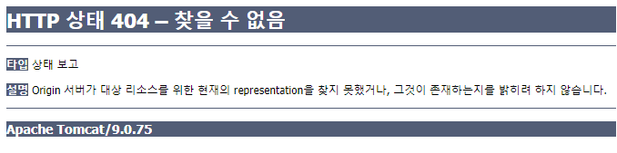

# 22장 스프링 JDBC 기능

> * MultiActionController를 사용하니... 스프링 버전은 아직 `4`로 유지해두자..
> * 복잡한 프로젝트가 아니여서, DB는 HSQLDB 메모리 모드로 사용했다.
> * 예제 프로젝트: 
>   * Spring 4 프로젝트
>     * [pro22-spring4](pro22-spring4)


## 21.1 스프링 JDBC로 데이터베이스와의 연동 설정하기

* ...


## 22.2 JdbcTemplate 클래스 이용해 회원 정보 조회하기

* ...


---

## 진행

* ...


## 의견

* 이번에도 잘 끝나긴 했다. 서블릿 컨텍스트 설정 파일을 root로 읽어서 삽질한 것 빼고는 ...🎃 그래도 설정파일들을 클래스 경로에 두는게 테스트가 편하다.. *
  *  이 설정 파일들이 WEB-INF 경로 이하에 있으면 JUnit 테스트에서 컨텍스트 파일들의 기준을 잡기가 힘듬.


## 정오표

* ...


## 기타

### MultiActionController 의 메서드 파라미터

1. 첫번째 파라미터: HttpServletRequest
2. 두번째 파라미터: HttpServletResponse
3. 세번째 파라미터: HttpSession 혹은 Command 객체 중 하나

첫번째에 커맨드 객체 넣어보려했는데.. 메서드 자체 인식이 안되서, 찾아보니.. 첫번째 두번째가 이미 규칙이 있었다.

반환형을 String으로 주고 리다이렉트 주소 주는 것도 잘 동작했다.

```java
return "redirect:/member/listMembers.do";
```


### 특정 컨트롤러 메서드에서 404가 발생했던 문제...



* 내가 설정 파일들을 전부 root context에서 읽게해서 그런 것 같다.

  > ```xml
  >  <context-param>
  >     <param-name>contextConfigLocation</param-name>
  >     <param-value>
  >       classpath:config/action-dataSource.xml
  >       classpath:config/action-service.xml
  >       classpath:action-servlet.xml
  >     </param-value>
  >   </context-param>
  > ```
  >
  > 서블릿 컨텍스트 설정만 따로 빼서 `action-servlet.xml`을 별도 설정해주면 문제가 해결되었다.
  >
  > ```xml
  >  <context-param>
  >     <param-name>contextConfigLocation</param-name>
  >     <param-value>
  >       classpath:config/action-dataSource.xml
  >       classpath:config/action-service.xml
  >     </param-value>
  >   </context-param>
  >   ...
  >     <servlet>
  >     <servlet-name>action</servlet-name>
  >     <servlet-class>org.springframework.web.servlet.DispatcherServlet</servlet-class>
  >     <init-param>
  >       <param-name>contextConfigLocation</param-name>
  >       <param-value>classpath:action-servlet.xml</param-value>
  >     </init-param>
  >     <load-on-startup>1</load-on-startup>
  >   </servlet>
  > ```

* https://stackoverflow.com/questions/43186315/tomcat-404-error-the-origin-server-did-not-find-a-current-representation-for-th

설정이 잘못되었긴 했지만... 오류 동작이 참 특이했던게... listMembers.do는 경로는 잘 찾아갔는데... addMember.do는 이상하게 못찾아갔었음.

MultiActionController 문제인줄 착각함.. 🎃

* ✨ 테스트 편의성을 위해서는 설정 파일들이 WEB-INF이하 경로가 아닌 classpath 경로에 위치시키는 것이 편했음.

