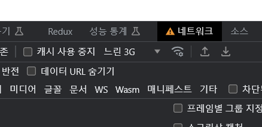

# 27장 메이븐과 스프링 STS 사용법

> * 이번장은 어떻게 진행해야할까? 🎃
>   * Maven 빌드 프로젝트 생성
>   
>     * 26장 Gralde 빌드로 작성한 프로젝트를 Maven 빌드 기반으로 전환해봐도 좋을 것 같긴하다.. 
>     * Gretty 대신 [cargo-maven-plugin](https://codehaus-cargo.github.io/cargo/Maven+3+Plugin.html)으로 Tomcat 실행되게 설정하자.
>   
>   * STS 사용법, MyBatis 사용 등등...
>   
>     * IntelliJ 사용중이니 넘어가자. 요즘 InteliJ의 MyBatis 지원이 꽤 좋아졌다. (Mapper 인터페이스 빈 찾을 수 없다는 경고가 있어왔는데.. 해결된듯.)
>   
>   * Apache Log4J
>   
>     * 로깅은 스터디 시작할 때부터 적용해서, 추가로 할 일은 없을 것 같다.  `Slf4j 구현으로 Log4j2 사용하고 있음.`
>   
>   * Apache Tiles
>   
>     * [Tiles](https://tiles.apache.org/framework/index.html)가 2017년 3.0.8 버전이후로 신버전이 나오지않고 개발 중단된 것 같은데...
>       * 새로 Maven 빌드로 분기한 프로젝트에는 적용해봐도 될 것 같긴함.
>     * ✨ Gradle 빌드 프로젝트의 경우... 아직 View가 복잡하진 않아서 이번기회에 `Thymeleaf`로 바꿔봐도 좋을 것 같다.
>   
>     
>   
>     	
>   
> * 예제 프로젝트
>   * Gradle 빌드
>     * [pro27](pro27)
>   * Maven 빌드
>     * [pro27-maven](pro27-maven)


## 27.1 메이븐 설치하기

* ...
* Maven에 대해서는 이미 잘 알고 있고, 잘 쓰고도 있어서...😅 
* Gradle 프로젝트도 Maven 프로젝트로 성공적으로 전환했다. 👍


## 27.2 메이븐 환경 변수 설정하기

* ...


## 27.3 STS 설치하기

* ...
* STS는 안쓰기로 함.. IntelliJ로 모든것이 아주 잘되고 있음..😅


## 27.4 메이븐 프로젝트의 구조와 구성 요소

* ...
* 솔직히 일찌감치 빌드 툴을 쓰는 식으로 진도가 구성되었어야 했다고 생각이 드는데...  
* 무의미한 노가다에 익숙해지면 안됨.. 좋은 방법이 있다면 빠르게 적용해야함.
* 지면의 pom.xml을 보니 여기는 Spring 4로 되어있음... 이전까지 라이브러리 복사는 Spring 3.0 이였던 것 같던데...


## 27.5 스프링 프로젝트 만들기

* ...


## 27.6 STS 프로젝트 실행하기

* ...
* `favicon.ico`을 넣긴했는데.. 제대로 쓸려면 Context Path를 /로 해야 브라우저에서 정상 인식한다.


## 27.7 STS 환경에서 마이바티스 사용하기

* ...

* Oracle 드라이버가 아마도... 2014년에도 Maven 레파지토리로 받을 수 있었던 것 같은데..

  * https://mvnrepository.com/artifact/oracle/ojdbc6/11.2.0.3

  * 그런데...  이부분 같은 경우는 호환성 문제가 있을 수 있어 정확히 버전 맞출려고 그랬을 수도 있겠다.

  * 나는 그냥 ojdbc 8로 쓰고 있음. (OracleXE 18c)

    ```groovy
    runtimeOnly "com.oracle.database.jdbc:ojdbc8:${ojdbcVersion}"
    ```

    

## 27.8 log4j란?

* ...
* 로거도 System.out 출력보다는 진도 초반에 설정해두고 쓰는게 좋긴했다...
* Log4j의 이전 버전들은 취약점이 많아서 항상 최신 버전을 유지하는 것이 좋음.
  * 근래에 심각한 원격 코드 실행 취약점 관련해서 재현을 해봤음.
    * https://github.com/mklinkj/log4j2-test


### 27.8.2 MyBatis SQL문을 로그로 출력하기

* ...

* ROOT로그를 debug로 설정하라고 설명을 하셨는데...

* 공식 문서에 따르면... Mapper 인터페이스에 대해 TRACE레벨로 로깅을 지정해주면 됨.. 나도 그렇게하고 있고..

  * https://github.com/mklinkj/log4j2-test

    ```xml
    <Logger name="org.mklinkj.taojwp.member.mapper.MemberMapper" level="TRACE"/>
    ```

    

## 27.9 타일즈란?

> * Spring 5 프로젝트인 [pro27-maven](pro27-maven) 프로젝트에만 적용하자!

#### 디펜던시 추가

```xml
<dependency>
    <groupId>org.apache.tiles</groupId>
    <artifactId>tiles-jsp</artifactId>
    <version>${tiles.version}</version>
</dependency>
```

* `tiles-servlet`은 `tiles-jsp`가 전이 의존성으로 가져옴.

### 컨텍스트 설정

```xml
  <bean id="tilesConfigurer" class="org.springframework.web.servlet.view.tiles3.TilesConfigurer">
    <property name="definitions">
      <list>
        <value>classpath:tiles/*.xml</value>
      </list>
    </property>
    <property name="preparerFactoryClass"
      value="org.springframework.web.servlet.view.tiles3.SpringBeanPreparerFactory"/>
  </bean>

  <mvc:view-resolvers>
    <bean class="org.springframework.web.servlet.view.tiles3.TilesViewResolver">
      <property name="viewClass" value="org.springframework.web.servlet.view.tiles3.TilesView"/>
    </bean>

    <bean class="org.springframework.web.servlet.view.InternalResourceViewResolver">
      <property name="viewClass" value="org.springframework.web.servlet.view.JstlView"/>
      <property name="prefix" value="/WEB-INF/views/"/>
      <property name="suffix" value=".jsp"/>
    </bean>
  </mvc:view-resolvers>
```

* Tiles 3 설정으로 일단은 이렇게 해봄... 
* 기존 뷰 경로도 같이 사용될 수 있게 InternalResourceViewResolver 설정도 같이 둠.


### 일단 Bootstrap으로 레이아웃을 구성해보고 있는데...

* ✨ Tiles + Srpgin 5 + Maven 빌드 프로젝트에 잘 적용해서 진행했다.  
* https://getbootstrap.kr/docs/5.2/layout/columns/


### 참고

* Apache Tiles Integration with Spring MVC
  * https://www.baeldung.com/spring-mvc-apache-tiles
* Spring MVC: from JSP and Tiles to Thymeleaf
  * https://spring.io/blog/2012/10/30/spring-mvc-from-jsp-and-tiles-to-thymeleaf
* Spring MVC - Tiles로 jsp 구성하기
  * https://seypark.tistory.com/126


## Spring 6 + Gradle 프로젝트에 Thymeleaf 적용

> Spring 5 + Maven 프로젝트에 Tiles를 성공적으로 적용했다.
>
> 이번에는 Spring 6 + Gradle 프로젝트에 Thymeleaf를 잘 적용해보자 😄🤗
>
> 부트라면 starter만 추가하면 되긴 하는데.. 일반 스프링이라 설정이 좀더 필요하긴함.


#### 디펜던시 추가

```groovy
implementation "org.thymeleaf:thymeleaf-spring6:${thymeleafVersion}"
implementation "org.thymeleaf.extras:thymeleaf-extras-springsecurity6:${thymeleafVersion}"
// https://mvnrepository.com/artifact/nz.net.ultraq.thymeleaf/thymeleaf-layout-dialect
implementation "nz.net.ultraq.thymeleaf:thymeleaf-layout-dialect:${thymeleafLayoutVersion}"
// https://mvnrepository.com/artifact/org.thymeleaf.extras/thymeleaf-extras-java8time
implementation "org.thymeleaf.extras:thymeleaf-extras-java8time:${thymeleafExtrasJava8timeVersion}"

```

* Spring Security를 사용중이니,  `thymeleaf-extras-springsecurity6` 도 추가
* Layout 을 편하게 사용하려면 `thymeleaf-layout-dialect` 를 사용하는 것이 좋다고 해서 추가.
  * layout/decorator 템플릿을 사용하여 콘텐츠의 스타일을 지정할 수 있는 Thymeleaf의 dialect.
* Java 8의 LocalDate를 사용하고 있어서... `thymeleaf-extras-java8time` 추가


#### 설정 추가 (action-servlet.xml)

```xml
  <bean id="templateResolver"
    class="org.thymeleaf.spring6.templateresolver.SpringResourceTemplateResolver">
    <property name="prefix" value="/WEB-INF/templates/"/>
    <property name="suffix" value=".html"/>
    <property name="templateMode" value="HTML"/>
    <property name="characterEncoding" value="UTF-8"/>
  </bean>

  <bean id="templateEngine" class="org.thymeleaf.spring6.SpringTemplateEngine">
    <property name="enableSpringELCompiler" value="true"/>
    <property name="messageSource" ref="messageSource" />
    <property name="additionalDialects">
      <set>
        <bean class="nz.net.ultraq.thymeleaf.layoutdialect.LayoutDialect"/>
        <bean class="org.thymeleaf.extras.springsecurity6.dialect.SpringSecurityDialect"/>
        <bean class="org.thymeleaf.extras.java8time.dialect.Java8TimeDialect"/>
      </set>
    </property>
    <property name="templateResolver" ref="templateResolver"/>
  </bean>

  <bean id="viewResolver" class="org.thymeleaf.spring6.view.ThymeleafViewResolver">
    <property name="characterEncoding" value="UTF-8"/>
    <property name="templateEngine" ref="templateEngine"/>
    <property name="order" value="1"/>
  </bean>
```

* Dialect 설정할 때... `additionalDialects`로 설정해야함. `dialect`로 설정하면 기본으로 포함된 것이 포함되지 않아. `th:href `같은 것들이 동작하지 않음


#### 메시지 리소스 사용할 때..

```html
<div th:if="${param.error}" class="alert alert-danger" role="alert">
  <span th:text="#{login.failure}"/>
</div>
```


#### Thymeleaf에서는 CSRF Hidden 필드를 직접 써줘야함.

```html
<input type="hidden" th:name="${_csrf.parameterName}" th:value="${_csrf.token}"/>
```

* `<sec:csrfInput>` 같이 쓸 수 있는 방법이 없는 것 같다.


#### th:errorclass 사용시 값을 css 클래스 값을 한번 따옴표(`'`)로 감싸줘야함.

```html
     <input type="password" name="pwd" th:field="*{pwd}" class="form-control"
                      th:errorclass="'form-control border-danger'" id="inputPassword3"/>
```


#### input 태그에서 th:field와 th:value의 차이

**thymeleaf 에서 th:field 를 쓰는 것과 th:value를 쓰는 것의 차이가 뭔지 아니?**

>  `th:field`와 `th:value`는 Thymeleaf에서 폼 입력 필드를 처리하는 데 사용되는 두 가지 속성입니다. `th:field`는 `name`, `id`, `value` 속성을 모두 설정합니다. 따라서 가능한 경우 `th:field`를 사용하는 것이 좋습니다. 이는 Spring과의 추가적인 통합을 제공하며 모든 종류의 입력에 작동합니다 ¹.
>
> 반면, `th:value`는 HTML의 `value` 속성을 수정하는 데 사용됩니다. 예를 들어, `<input>` 태그의 값을 설정하려면 다음과 같이 작성할 수 있습니다:
>
> ```html
> <input type="text" th:value="${model.field}">
> ```
>
> 이렇게 하면 `<input>` 태그의 값이 `${model.field}`의 값으로 설정됩니다. 추가 정보가 필요하시면 알려주세요.
>
> 
>
> 출처: Bing과의 대화, 2023. 6. 10.(1) java - Spring MVC and Thymeleaf - What's the difference between th:value and th:field .... https://stackoverflow.com/questions/54677313/spring-mvc-and-thymeleaf-whats-the-difference-between-thvalue-and-thfield-w 액세스한 날짜 2023. 6. 10..
> (2) Difference between th:text and th:value in Thymeleaf. https://stackoverflow.com/questions/47374349/difference-between-thtext-and-thvalue-in-thymeleaf 액세스한 날짜 2023. 6. 10..
> (3) thymeleaf中th:field和th:value的区别_神石石的博客-CSDN博客. https://blog.csdn.net/wh1236666/article/details/107716996 액세스한 날짜 2023. 6. 10..
> (4) spring-boot(thymeleaf)中th:field和th:value的区别 - CSDN博客. https://blog.csdn.net/qq_43279637/article/details/86406836 액세스한 날짜 2023. 6. 10..
> (5) Thymeleaf th:field doesn't bind the value for input text. https://stackoverflow.com/questions/54823408/thymeleaf-thfield-doesnt-bind-the-value-for-input-text 액세스한 날짜 2023. 6. 10..

이걸 물어본 이유가 ...

```html
        <div class="col-sm-8">
          <input type="password" name="pwd" th:value="*{pwd}" class="form-control"
                      th:errorclass="'form-control border-danger'" id="inputPassword3"/>
          <span class="text-danger" th:errors="*{pwd}">암호 입력 오류 메시지</span>
        </div>
```

pwd 같은 경우는 값들이 다음과 같이 복잡한 값이 들어가는데..

```
{bcrypt}$2a$10$nbBajJQNP74sZhR2/gWd5uqzfumh9yZytvho8m4c666/Zsa6Jcpta
```

이걸 `th:field="*{pwd}"`로 받으면 표시가 안된다.

확실히 이유를 모르겠음, 일단은 이부분은 `th:value`를 쓰기로 했다.

위의 빙 AI 답변대로 field를 쓰면 

```html
<input type="text" th:field="*{name}" class="form-control"
                 th:errorclass="'form-control border-danger'" />

<input type="text" class="form-control"
                 id="name" name="name" value="최치원" />
```

id, name, value(name의 값) 3가지를 전부 설정해준다. 그런데 이미 태그에 id, name을 정의한 상태라면 그것을 우선함.

그런데 여전히 pwd 필드에 대해서는 값을 출력하지 못하는 이유를 잘 모르겠다.. 🎃


#### `<script th:inline="javascript">`에서 `th:inline="javascript"`를 꼭 써줘야 내부의 타임리프 인라인 코드를 해석해주니?

> 네, `<script th:inline="javascript">`를 사용하면 Thymeleaf가 JavaScript `<script>` 블록을 처리할 수 있습니다. 이를 사용하면 HTML 템플릿 모드의 모든 기능을 JavaScript 블록에서 사용할 수 있습니다². 따라서 Thymeleaf 변수를 JavaScript 코드에서 사용하려면 `th:inline="javascript"` 속성을 명시적으로 지정해야 합니다⁵.
>
> 출처: Bing과의 대화, 2023. 6. 10.(1) [Thymeleaf] JavaScript Inlining (자바스크립트 인라인). https://maenco.tistory.com/entry/Thymeleaf-JavaScript-Inlining-자바스크립트-인라인 액세스한 날짜 2023. 6. 10..
> (2) How set a JavaScript variable in Thymeleaf - Atta-Ur-Rehman Shah. https://attacomsian.com/blog/thymeleaf-set-javascript-variable 액세스한 날짜 2023. 6. 10..
> (3) JavaScript Function Call with Thymeleaf | Baeldung. https://www.baeldung.com/thymeleaf-js-function-call 액세스한 날짜 2023. 6. 10..
> (4) Thymeleaf踩坑（th:inline=“javascript“）_老秃爵的博客-CSDN博客. https://blog.csdn.net/weixin_49610478/article/details/108319573 액세스한 날짜 2023. 6. 10..
> (5) ThymeleafでJavaScriptを埋め込む（インライン）方法 - ミルラク. https://miruraku.com/java/thymeleaf/javascript/inline/ 액세스한 날짜 2023. 6. 10..

* 저거 안써가지고 처리가 안되는줄 알고 고생했다. 🎃

  ```html
  <script th:inline="javascript">
    const result = /*[[${result}]]*/ false;
    const message = /*[[#{|modify.${result}|}]]*/ 'Modify Success Message';
    if (result) {
      alert(message);
    }
  </script>
  ```

  관련해서 메시지 프로퍼티 처리도 잘 해결 했다.


#### MVC 테스트 할 때.. forwardedUrl() 테스트는 의미가 없을 것 같다.

```java
  @Test
  void testListMembersDo() throws Exception {
    mockMvc
        .perform(get("/member/listMembers.do"))
        .andDo(print())
        .andExpect(status().isOk())
        .andExpect(model().attributeExists("memberList"))
        .andExpect(view().name("member/listMembers"))
        .andExpect(forwardedUrl("/WEB-INF/views/member/listMembers.html")); // forwardedUrl 값이 null
  }
```

* forwardedUrl 코드는 지우고 view이름만 테스트하는 것이 낫겠다.


### 참고 링크

* Thymeleaf 3.1: What’s new and how to migrate
  * https://www.thymeleaf.org/doc/articles/thymeleaf31whatsnew.html
* https://www.thymeleaf.org/doc/articles/thymeleaf3migration.html
  * https://www.thymeleaf.org/doc/articles/thymeleaf3migration.html


---

## 진행

* ...
  


## 의견

* ...


## 정오표

* ...


## 기타

### webjars-locator를 사용해도 이상하게 버전명시해야 접근되는 문제가 있어 검색..

* 가장 도움 되었다.
  * https://stackoverflow.com/questions/35536836/remove-webjars-version-from-url
  * 어떻게 하더라도 제대로 동작하지 않아서 직접 컨트롤러 메서드를 

* https://www.webjars.org/documentation#springmvc
* https://github.com/spring-projects/spring-boot/blob/2.0.x/spring-boot-project/spring-boot-autoconfigure/src/main/java/org/springframework/boot/autoconfigure/web/servlet/WebMvcAutoConfiguration.java
* https://www.springcloud.io/post/2021-12/client-side-development-with-spring-boot-applications/#gsc.tab=0


### 좀  더 보니.. Java 17 환경에서 WebJarAssetLocator의 getWebJars() 실행시 버전 정보를 못읽는다.. (또 나중엔 읽음 😆🎃👺)

```java
    WebJarAssetLocator LOCATOR = new WebJarAssetLocator();
    Map<String, String> webjars = LOCATOR.getWebJars();
```

```
{jquery=3.6.4, bootstrap=5.3.0}
```

위와 같은 식으로 버전이 조회가 되야하는데... 실행 코드를 그대로 두면서 Java 17로 환경을 올리면 

```
{jquery=null, bootstrap=null}
```

null로 나오는 경우가 있었는데... 지금 17다시 올리고 보니 다시 잘됨.? 😆 미치겠음...

그래도 알려진 설정으로는 절대로 버전없이 사용할 수가 없어서.. 경로를 만들어주는 컨트롤러 작성했음..

```java
@Slf4j
@Controller
public class WebJarsController {
  private static final WebJarAssetLocator LOCATOR = new WebJarAssetLocator();

  @ResponseBody
  @GetMapping("/webjars_locator/{webjar}/**")
  public ResponseEntity<Resource> locateWebjarAsset(
      @PathVariable String webjar, HttpServletRequest request) {

    try {
      String version = LOCATOR.getWebJars().get(webjar);
      String mvcPrefix = String.format("/webjars_locator/%s/", webjar);
      String mvcPath =
          (String) request.getAttribute(HandlerMapping.PATH_WITHIN_HANDLER_MAPPING_ATTRIBUTE);
      String fullPath =
          String.format(
              "META-INF/resources/webjars/%s/%s/%s",
              webjar, version, mvcPath.substring(mvcPrefix.length()));

      return new ResponseEntity<>(new ClassPathResource(fullPath), HttpStatus.OK);
    } catch (Exception e) {
      LOGGER.error(e.getMessage(), e);
      return new ResponseEntity<>(HttpStatus.NOT_FOUND);
    }
  }
}
```

내부 동작 확인 때문에 이렇게하긴 했는데...

* https://stackoverflow.com/questions/35536836/remove-webjars-version-from-url  이 분처럼 getFullPath() 메서드를 활용하는 것이 좋을 것 같다.
* 그냥 스프링 부트를 썼으면 알아서 설정이 되어있을 텐데...


### 동작에는 문제가 없지만... 약간 찝찝한 문제가.... 

응답의 Content-Type 값이 정확하게 나오지 않는다..

* 응답 헤더의 Content-Type이 css / js 모두  `text/html;charset=UTF-8`  로 나타남 (Firefox)

  * 원래대로라면...

    * JavaScript:  `application/javascript;charset=UTF-8`
    * css: `text/css;charset=UTF-8`

  * WebJarsController 의 메서드에다가 확장자를 보고 response에 ContentType을 설정해주면.. 되기는 될테지만.. 그렇게 까지 해야하는지? 😂😂😂

    ```
     execute script from 'http://localhost:8090/pro27/webjars_locator/jquery/jquery.slim.min.js' because its MIME type ('application/json') is not executable, and strict MIME type checking is enabled.
    listMembers.do:1 Refused to execute script from 'http://localhost:8090/pro27/webjars_locator/bootstrap/js/bootstrap.bundle.min.js' because its MIME type ('application/json') is not executable, and strict MIME type checking is 
    ```

  * 실행은 되긴 되는데.. 콘솔 에러가 나서... ㅠㅠ

    ```java
          return ResponseEntity.status(HttpStatus.OK) //
              .header(HttpHeaders.CONTENT_TYPE, getContentType(fullPath))
              .cacheControl(CacheControl.maxAge(Duration.ofDays(7)))
              .body(new ClassPathResource(fullPath));
    ```

    반환할 때... 확장자 보고 컨텐트 타입을 지정하게 했다..

    * 특이하게도 캐시를 설정안하면 항상 새로받아서 설정해야했다. (css파일 자체가 커서...ㅠㅠ)


그런데 아무리 그래도 웰케 느리지!! 확인해보니... 크롬 네트워크 탭에 `느린 3G`로 설정되어있었음 😂😂😂



그래도 캐시 문제 확인하는데는 도움이 되었음 👍


### 컨텐츠 타입을 확장자 보고 수동으로 판단했었는데...

Java 1.7부터는 `Files.probeContentType()`란 메서드가 준비되어있다.

```java
Files.probeContentType(Path.of(classPathResource.getPath())))
```

css나 javascript 리소스를 정확하게 판단할 수 있었다.


### 그동안 예제 프로젝트에 Content Path를 프로젝트 이름으로 지정했는데,  그냥 `/`로 해도 될 것 같다.

* Tocmat 하나에 여러개 띄울 것도 아니여서... 😅
* 근래의 추세는 그냥 앞단에 L4나 HTTP두고 도메인 기준으로 분리하는 추세라서..


### Tiles를 적용하고나서 MVC 테스트의 forward URL이  레이아웃 JSP 로만 보게되는 현상

```
...
java.lang.AssertionError: Forwarded URL expected:</WEB-INF/views/member/memberForm.jsp> but was:</WEB-INF/views/common/layout.jsp>
필요:/WEB-INF/views/member/memberForm.jsp
실제   :/WEB-INF/views/common/layout.jsp
...
```

> **Spring MVC 프로젝트에 Tiles 를 적용하고나서... .andExpect(forwardedUrl("포워딩URL")); 위 테스트 검증을 할 때... 포워딩 URL이 항상 Tiles의 레이아웃 JSP로 설정되는데... 세부 설정을 할 수가 없는 것이니?**
>
> > Tiles를 사용하는 Spring MVC 애플리케이션에서는 `forwardedUrl()` 메소드로 뷰 이름을 검증하는 것이 어려울 수 있습니다. JSP 페이지의 내용은 서블릿 컨테이너에 의해 렌더링되기 때문에, Spring MVC Test에서는 서블릿 컨테이너를 실행하지 않기 때문에 JSP 페이지의 내용에 대한 검증은 할 수 없습니다. [따라서 뷰 이름이 올바른지, 그리고 요청이 올바른 URL로 전달되었는지만 검증할 수 있습니다](https://stackoverflow.com/questions/28944538/empty-content-in-spring-mvc-test). 이 점 참고하시기 바랍니다.
>
> 

음.. 일단 어쩔수 없이... `/WEB-INF/views/common/layout.jsp` 만 검사해야겠다.. 😅


### 암호화된 암호 영역이 너무 길어서, 줄여서 표시되도록 ..

```html
          <td>
            <span class="d-inline-block text-truncate" style="max-width: 150px">
              ${mem.pwd}
            </span>
          </td>
```

* [Text truncation · Bootstrap v5.3 (getbootstrap.com)](https://getbootstrap.com/docs/5.3/helpers/text-truncation/)
