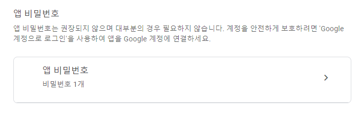

# 28장 스프링에서 지원하는 여러가지 기능

> * 이번장도 프로젝트를 나눠서 해보면 좋겠다.
> 
>   * 예제 프로젝트
>   * Spring 6 + Gradle 빌드
>     * [pro28](pro28)
>       * Servlet 3 부터 서블릿 컨테이너 자체에 내장된 기능으로 사용.
>   * Spring 5 + Maven 빌드
>       * [pro28-maven](pro28-maven)
>     * commons-fileupload 사용.


---

## 진행

* ...
  


## 의견

* ...


## 정오표

* ...


## 기타

### getOriginalFilename()

> 클라이언트의 파일 시스템에 있는 원본 파일명을 반환합니다.
> 사용하는 브라우저에 따라 경로 정보가 포함될 수 있지만 일반적으로 Opera 이외의 브라우저에서는 포함되지 않습니다.
> 참고: 이 파일 이름은 클라이언트가 제공한 것이므로 무턱대고 사용해서는 안 된다는 점에 유의하세요. 디렉토리 부분을 사용하지 않는 것 외에도 파일 이름에 '..' 등의 문자가 포함될 수 있으며 악의적으로 사용될 수 있습니다. 이 파일명을 직접 사용하지 않는 것이 좋습니다. 가급적 고유한 파일명을 생성하고 필요한 경우 이 파일명을 참조할 수 있도록 어딘가에 저장하세요.
>
> #### 반환
>
> 원본 파일 이름, 또는 다중 파트 형식에서 파일이 선택되지 않은 경우 빈 문자열, 정의되지 않았거나 사용할 수 없는 경우 null을 반환합니다.

### getFileNames()

> 이 요청에 포함된 다중 파트 파일의 매개변수 이름이 포함된 문자열 객체 이터레이터를 반환합니다. 이는 일반 매개변수와 마찬가지로 양식의 필드 이름이며, 원본 파일 이름이 아닙니다.
>
> #### 반환
>
> 파일 이름

---

## 스프링 시큐리티와 multipart-form (Spring 5 + Spring Security5 + Servlet 4 + JSP)

### 디펜던시 추가

```xml
    <dependency>
      <groupId>commons-fileupload</groupId>
      <artifactId>commons-fileupload</artifactId>
      <version>${commons-fileupload.version}</version>
    </dependency>
    <dependency>
      <groupId>commons-io</groupId>
      <artifactId>commons-io</artifactId>
      <version>${commons-io.version}</version>
    </dependency>
```


## src/main/webapp/META-INF/context.xml 에 다음을 설정

```xml
<?xml version="1.0" encoding="UTF-8"?>
<Context allowCasualMultipartParsing="true" path="/" >
  <WatchedResource>WEB-INF/web.xml</WatchedResource>
  <!-- <Resources cachingAllowed="true" cacheMaxSize="100000" /> --> <!-- 기본값이여서 명시할 필요없음-->
</Context>
```

Tomcat 에다 직접 설정해도 되는데, 프로젝트 별로 설정하기 위해서, 위의 위치에 설정했다.

> - **allowCasualMultipartParsing**: 이 설정은 multipart/form-data 형식의 요청을 처리하는 데 사용됩니다. 이 설정을 true로 설정하면 Tomcat은 multipart/form-data 형식의 요청을 처리할 때 Servlet 3.0 API를 사용합니다. 이 설정을 false로 설정하면 Tomcat은 multipart/form-data 형식의 요청을 처리할 때 Servlet 2.5 API를 사용합니다. Servlet 3.0 API는 Servlet 2.5 API보다 더 강력하고 기능이 풍부합니다. 따라서 이 설정을 true로 설정하는 것이 좋습니다.
> - **cachingAllowed, cacheMaxSize**: 이 설정은 리소스를 캐시하는 데 사용됩니다. 이 설정을 true로 설정하면 Tomcat은 리소스를 캐시합니다. 이 설정을 false로 설정하면 Tomcat은 리소스를 캐시하지 않습니다. cacheMaxSize는 캐시할 수 있는 리소스의 최대 크기를 지정합니다. 리소스를 캐시하면 리소스를 요청할 때마다 서버에서 리소스를 가져올 필요가 없기 때문에 성능을 향상시킬 수 있습니다. 따라서 이 설정을 true로 설정하는 것이 좋습니다. 그러나 cacheMaxSize를 너무 높게 설정하면 캐시가 너무 커져 성능이 저하될 수 있습니다. 따라서 cacheMaxSize를 적절한 값으로 설정하는 것이 중요합니다.


### web.xml의 스프링 시큐리티 필터 설정 앞에 MultipartFilter 배치

```xml
  <filter>
    <display-name>springMultipartFilter</display-name>
    <filter-name>springMultipartFilter</filter-name>
    <filter-class>org.springframework.web.multipart.support.MultipartFilter</filter-class>
  </filter>
  <filter-mapping>
    <filter-name>springMultipartFilter</filter-name>
    <url-pattern>/*</url-pattern>
  </filter-mapping>

  <!-- DelegatingFilterProxy ... -->
  <!-- ... -->
```


### 서블릿 컨텍스트 설정의 CommonsMultipartResolver 의 빈이름을 filterMultipartResolver로 설정

```xml
  <!-- DispatcherServlet 로딩 이전에 이미 있어야지만 MultipartFilter에서 로딩이 가능하므로 루트 컨텍스트에 선언 -->
  <bean name="filterMultipartResolver"
    class="org.springframework.web.multipart.commons.CommonsMultipartResolver">
    <property name="maxUploadSize" value="52428800"/> <!-- 50MB -->
    <property name="maxInMemorySize" value="10485760"/> <!-- 10MB -->
    <property name="maxUploadSizePerFile" value="10485760"/> <!-- 10MB -->
    <property name="defaultEncoding" value="utf-8"/>
  </bean>
```

* MultipartFilter가 기본으로 인식하는 이름이 `filterMultipartResolver` 인데, 맞춰주자.

* 이 빈설정은... DispatcherServlet 로딩 이전에 되야하므로 Root 컨텍스트에 넣어줘야 제대로 동작한다.

  * 이 Bean을 못읽을 경우..  `StandardServletMultipartResolver`로 처리되기 때문에 commons-upload 도 사용하면서 Servlet의 Multipart 기능도 사용하게되서 설정이 꼬이게 된다.

    > maxUploadSizePerFile 설정이 안먹어서, web.xml에 max-file-size 설정을 해줘야하는 설정이 중복된상태가 됨.. 😅


---

## 스프링 시큐리티와 multipart-form (Spring 6 + Spring Security6 + Servlet 6 + Thymeleaf)

### 디펜던시 추가

* 서블릿 컨테이너가 자체적으로 지원하는 기능을 사용해서, 추가할 내용 없음.


### web.xml에 디스패쳐 서블릿 설정 이하에 `<multipart-config>` 설정을 추가한다.

```xml
  <servlet>
    <servlet-name>action</servlet-name>
    <servlet-class>org.springframework.web.servlet.DispatcherServlet</servlet-class>
    <load-on-startup>1</load-on-startup> <!-- 값이 1 이상이면 Tomcat 실행시 미리 메모리에 로드 -->
    <multipart-config>
      <!-- 임시 파일을 저장할 공간 : 기본은 시스템 임시 폴더이다.  -->
      <!--<location>${java.io.tmpdir}</location>-->
      <!-- 업로드되는 파일의 최대 크기 -->
      <max-file-size>10485760</max-file-size> <!-- 10MB -->
      <!-- 한번에 올릴 수 있는 최대 크기 -->
      <max-request-size>52428800</max-request-size> <!-- 50MB -->
      <!-- 파일이 메모리에 기록되는 임계값  -->
      <file-size-threshold>10485760</file-size-threshold> <!-- 10MB -->
    </multipart-config>
  </servlet>
```

* location 같은 경우는 시스템 기본 값을 쓰게하는 게 낫겠다.


### Thymeleaf에서는 백틱으로 감싼 JavaScript 구문에 모델 변수 값을 사용할 때.. 이스케이프를 하지 말아야한다.

```html
   $("#d_file").append(
        `<div class="mb-3">
          <label for="formFile${count}" class="form-label">${count}번 파일</label>
          <input class="form-control" type="file" id="formFile${count}" name="file${count}">
        </div>`
    );
```

✨ 예상외로 별로 바꿀 것이 없었다. 컨트롤러 코드자체가 Spring Web이하의 클래스만 쓰다보니.. 그대로 활용가능 했다.


---

## Mail 설정

Google 계정을 사용하므로, 계정 ID / PW을 Vault에다 저장해서 쓰자..

메일을 2개 가입해야함...


### 스프링 6 + Java Mail

> https://mvnrepository.com/artifact/jakarta.mail/jakarta.mail-api 이거 구현체 라이브러리가 따로 있니?
>
> >네, `jakarta.mail-api`의 구현 라이브러리가 있습니다. Jakarta Mail API의 구현체로 알려진 JavaMail/JakartaMail은 이제 **Eclipse Angus**라는 독립적인 프로젝트로 제공됩니다. Eclipse Angus 프로젝트 페이지에서 더 많은 정보를 찾을 수 있습니다.
>
> * https://mvnrepository.com/artifact/jakarta.mail/jakarta.mail-api/2.1.2
>
> * 디펜던시 설정
>
>   ```groovy
>     implementation "jakarta.mail:jakarta.mail-api:${jakartaMailApiVersion}"
>     implementation "org.eclipse.angus:jakarta.mail:${jakartaMailImplVersion}"
>   ```
>
>   


### 스프링 5 + Java Mail

> * 디펜던시 설정
>
>   ```xml
>       <dependency>
>         <groupId>javax.mail</groupId>
>         <artifactId>javax.mail-api</artifactId>
>         <version>${javax.mail.version}</version>
>       </dependency>
>       <dependency>
>         <groupId>com.sun.mail</groupId>
>         <artifactId>javax.mail</artifactId>
>         <version>${javax.mail.version}</version>
>       </dependency>
>   ```
>
>   


### Gmail 앱 비밀번호 설정

> * Java Mail 클라이언트에서 Gmail의 smtp 서버에 로그인 하려면, 기본 암호로는 로그인이 안됨.
>
> * 앱 비밀번호를 설정해야함.
>
>   * 2단계 인증을 활성화하고 앱 비밀번호 설정하여, 그것을 smtp 로그인 암호로 사용하면 됨.
>
>     


### 비동기 설정

* AsyncConfig

  ```java
  @Configuration
  @EnableAsync
  public class AsyncConfig implements AsyncConfigurer {
  
    @Override
    public Executor getAsyncExecutor() {
      ThreadPoolTaskExecutor executor = new ThreadPoolTaskExecutor();
      executor.setThreadNamePrefix("async-thread-");
      executor.setCorePoolSize(5);
      executor.setMaxPoolSize(10);
      executor.setQueueCapacity(30);
      executor.setRejectedExecutionHandler(new ThreadPoolExecutor.CallerRunsPolicy());
      executor.initialize();
      return executor;
    }
  }
  ```

  #### 바드에게 의미 해석

  > 제공하신 코드는 `Executor` 인스턴스를 반환하는 메소드입니다. `Executor`는 비동기적으로 작업을 실행하는 데 사용할 수 있는 객체입니다. 코드는 `ThreadPoolTaskExecutor` 인스턴스를 생성합니다. `ThreadPoolTaskExecutor`는 작업을 실행하기 위해 스레드 풀을 사용하는 `Executor`의 한 유형입니다.
  >
  > `ThreadPoolTaskExecutor` 인스턴스는 다음 매개변수로 구성됩니다.
  >
  > - `threadNamePrefix`: 스레드 풀의 스레드 이름에 사용되는 접두사입니다.
  > - `corePoolSize`: 스레드 풀에 항상 유지되는 스레드 수입니다.
  > - `maxPoolSize`: 스레드 풀이 생성하는 최대 스레드 수입니다.
  > - `queueCapacity`: 스레드 풀에 대기할 수 있는 최대 작업 수입니다.
  > - `rejectedExecutionHandler`: 스레드 풀에서 거부된 작업을 처리하는 데 사용되는 정책입니다.
  >
  > `ThreadPoolTaskExecutor` 인스턴스가 생성되면 초기화되고 반환됩니다.
  >
  > 다음은 코드에 대한 보다 자세한 설명입니다.
  >
  > 코드 스니펫
  >
  > ```java
  > ThreadPoolTaskExecutor executor = new ThreadPoolTaskExecutor();
  > ```
  >
  > 이 줄은 새로운 `ThreadPoolTaskExecutor` 인스턴스를 생성합니다.
  >
  > 코드 스니펫
  >
  > ```java
  > executor.setThreadNamePrefix("async-thread-");
  > ```
  >
  > 이 줄은 스레드 풀의 스레드 이름에 사용되는 접두사를 설정합니다. 접두사는 "async-thread-"입니다.
  >
  > 코드 스니펫
  >
  > ```java
  > executor.setCorePoolSize(5);
  > ```
  >
  > 이 줄은 스레드 풀에 항상 유지되는 스레드 수를 설정합니다. 스레드 수는 5입니다.
  >
  > 코드 스니펫
  >
  > ```java
  > executor.setMaxPoolSize(10);
  > ```
  >
  > 이 줄은 스레드 풀이 생성하는 최대 스레드 수를 설정합니다. 최대 스레드 수는 10입니다.
  >
  > 코드 스니펫
  >
  > ```java
  > executor.setQueueCapacity(30);
  > ```
  >
  > 이 줄은 스레드 풀에 대기할 수 있는 최대 작업 수를 설정합니다. 최대 대기열 용량은 30입니다.
  >
  > 코드 스니펫
  >
  > ```java
  > executor.setRejectedExecutionHandler(new ThreadPoolExecutor.CallerRunsPolicy());
  > ```
  >
  > 이 줄은 스레드 풀에서 거부된 작업을 처리하는 데 사용되는 정책을 설정합니다. 사용되는 정책은 `ThreadPoolExecutor.CallerRunsPolicy`입니다. 즉, 작업은 작업을 제출한 스레드에서 실행됩니다.
  >
  > 코드 스니펫
  >
  > ```java
  > executor.initialize();
  > ```
  >
  > 이 줄은 `ThreadPoolTaskExecutor` 인스턴스를 초기화합니다.
  >
  > 코드 스니펫
  >
  > ```java
  > return executor;
  > ```
  >
  > 이 줄은 `ThreadPoolTaskExecutor` 인스턴스를 반환합니다.

  ### `executor.setRejectedExecutionHandler(new ThreadPoolExecutor.CallerRunsPolicy());` 이게 스레드풀에 제출하려했는데... 풀이 꽉차서 거부된 스레드는 본인이 실행해라라는 의미이니?

  > 네, 맞습니다. `ThreadPoolExecutor.CallerRunsPolicy`는 스레드 풀에 작업을 제출했지만 풀이 꽉 차서 거부된 경우 작업을 제출한 스레드에서 작업을 실행하는 정책입니다.
  >
  > > Pool도 꽉차있고, Queue도 전부다 꽉차있어서 할 수있는 것이 없을 때이지?
  > >
  > > >네, 맞습니다. 스레드 풀이 꽉 차서 작업을 실행할 스레드가 없고, 작업 대기열도 꽉 차서 작업을 추가할 수 없을 때 `ThreadPoolExecutor.CallerRunsPolicy`는 작업을 제출한 스레드에서 작업을 실행합니다.


---

## HTML 형식 메일보내기는 FreeMarker/Thymeleaf를 사용해보면 좋을 것 같다..

> Gradle 프로젝트는 Thymeleaf로 템플릿을 만들고, 
>
> * https://www.thymeleaf.org/doc/articles/springmail.html
>
> Maven 프로젝트는 FreeMarker를 사용해보면 좋을 것 같다.
>
> * https://docs.spring.io/spring-framework/reference/web/webmvc-view/mvc-freemarker.html
> * https://www.baeldung.com/freemarker-in-spring-mvc-tutorial


### FreeMarker 활용

* https://freemarker.apache.org/docs/pgui_quickstart_all.html 에 나온대로

  * 설정 부분은 설정 빈로 만들고, (어플리케이션 수명주기와 같이해야한다함..)
  * 실행 부분은 서비스 빈으로 만듬.

* 거의 메뉴얼 보고 했는데... 주의할 점이.. 메뉴얼에서는 System.out에다가 출력을 하고 있어서.. 이걸 close해버리면 테스트가 제대로 안된다.. 당연하게도 실제환경에서도 큰 문제가 있겠지만... 🎃

  ```java
  public String bookEmailTemplate(Book book) { 
    try {
      /* Get the template (uses cache internally) */
      Template template = freemarkerCfg.getTemplate("book_mail.ftl");
      try (Writer out = new OutputStreamWriter(System.out)) {
        template.process(Map.of("book", book), out);
        return out.toString();
      }
    } catch (Exception e) {
        throw new IllegalStateException(e);
    }
  }
  ```

  이거를 OutputStream 사용 부분을 StringWriter로 바꿔주면 잘 된다.

  ```java
    public String bookEmailTemplate(Book book) {
      try {
        /* Get the template (uses cache internally) */
        Template template = freemarkerCfg.getTemplate("book_mail.ftl");
        StringWriter out = new StringWriter();
        template.process(Map.of("book", book), out);
        return out.toString();
      } catch (Exception e) {
        throw new IllegalStateException(e);
      }
    }
  ```

  

  * https://freemarker.apache.org/docs/pgui_quickstart.html
    * https://freemarker.apache.org/docs/pgui_quickstart_merge.html
    * https://freemarker.apache.org/docs/pgui_quickstart_all.html


### Thymeleaf 활용

> 이메일 템플릿 관련해서 구체적으로 가이드가 있어서 좋은데... 번역을 먼저 해야겠다.
>
> * https://www.thymeleaf.org/doc/articles/springmail.html

가이드에는 메시지 처리등 더 복잡한 내용이 있었지만, FreeMarker 적용했던 수준과 비슷하게 간단하게 적용했다.


---

## 스프링 인터셉터

> 인터셉터 적용은 Spring 5, 6이나 별차이가 없겠다. 


### 다국어 기능

* `HandlerInterceptorAdapter` 5.3 부터 Depreacted 되었다. 
  * Java 8 부터 인터페이스에 default 메서드를 정의할 수 있어서 `HandlerInterceptor` 인터페이스를 구현해서 쓰라는 것 같다.


* LocaleInterceptor에서 다른 메서드는 구현할 필요가 없으니...  preHandle만 구현하자!

* 파라미터 값이 없을 때, 기본 값 로케일을 설정하는 저자님 방법 보다는... locale 파라미터가 유입 되었을 때만, 로케일을 새로 설정하는 것이 낫겠다.

  ```java
      if (locale != null && !locale.isBlank()) {
        LOGGER.info("### new locale: {}", locale);
        session.setAttribute(SessionLocaleResolver.LOCALE_SESSION_ATTRIBUTE_NAME, new Locale(locale));
      }
  ```

  * 단순 페이지면 저자님 방법도 될 것 같긴한데, 나는 Tiles / Thymeleaf 적용도 했고 복잡해져서인지... 저자님 방법으로는 결국은 항상 기본값 로케일을 설정해버리는 문제가 생겼다.


