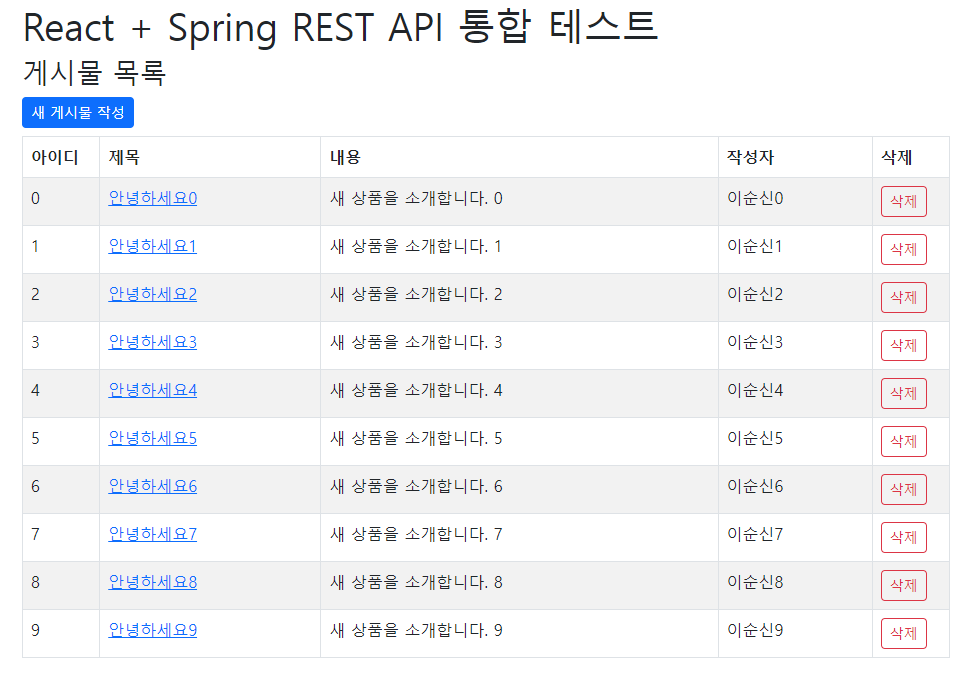
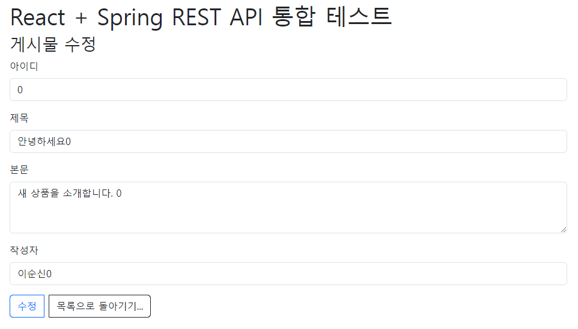

# 29장 스프링 REST API 사용하기

> * REST API 자체는 크게 버전을 타는 부분이 없어서.. 
> 
>   * 이번장은 예제 프로젝트를 하나만 만들어도 되겠다. 
>   
>   * Spring 6 + Gradle 빌드
>     * [react-spring](react-spring)
>   
>     

* ...


---

## 진행

* REST API를 만들지 않아본 것은 아닌데... 어떻게 진행을 할까... 
* 전에 React + Spring 통합 테스트 해봤던 프로젝트를 활용해서.. 진행해보자..
  * https://github.com/mklinkj/QnA/tree/master/React/react-spring
  * 그런데 뷰를 HTML + Ajax로 해도 되긴되는데... 오히려 React에 익숙하지 않아서... 😅
  * 일단 Spring Security는 미적용.
  * 프런트앤드를 한 프로젝트로 통합해버리긴 했는데.. 따로 가는게 나았을려나...😅


### 프로젝트 실행방법

* Java (API) 서버만 실행

  ```sh
  gradle clean appRun
  ```

* React 프론트 앤드 빌드 후 Java (API) 서버 실행

  ```sh
  gradle clean appRunReact
  ```

* war 생성하여 실행 (React 프론트 앤드 포함)

  ```sh
  gradle clean appRunWar
  ```

  

### API서버의 CORS 설정

API 컨트롤러에 아래 내용을 정의함.

```java
@CrossOrigin({"http://localhost:8090"})
```


## 의견

* 아직은 React에 대해 잘 몰라서..  Props, State등을 복잡하게 사용한 것 같긴한데... 처음 생각한대로 잘 동작해서 기분은 좋다.. 😅
* React Bootstrap이 꽤 괜찮은 것 같다. 쉽게 부트 스트랩을 적용했음.


## 정오표

* ...


## 기타


### React Bootstrap을 사용해보자.

* 가이드: https://react-bootstrap.netlify.app/docs/getting-started/introduction

* 예제코드: https://codesandbox.io/s/github/react-bootstrap/code-sandbox-examples/tree/master/basic-v5

* 설치
  ```sh
  npm install react-bootstrap bootstrap
  ```
  
* index.js에 bootstrap.min.css 추가 필요

  ```jsx
  // Importing the Bootstrap CSS
  import 'bootstrap/dist/css/bootstrap.min.css';
  ```

  

### React + Spring REST API 통합 테스트 프로젝트는 잘 진행되었다. 

* 메인 화면

  

* 폼 화면
  

